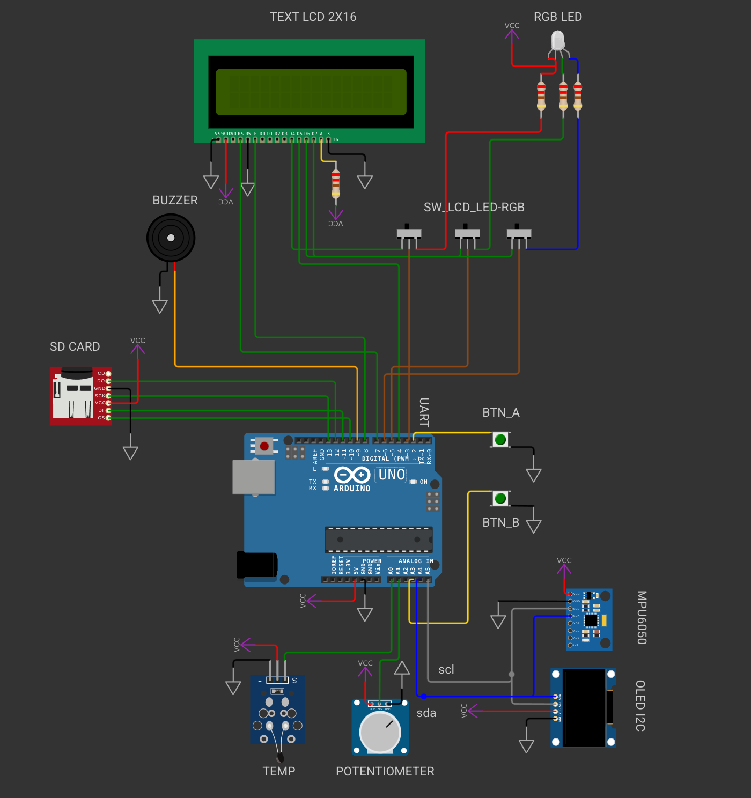

import TwoColumn from '@site/src/components/TwoColumn';
import CodeSnippet from '@site/src/components/CodeSnippet.tsx';
import * as snippets from '@site/snippets/code-snippets01.mdx';
import Tabs from '@theme/Tabs';
import TabItem from '@theme/TabItem';


# Lab 3: PWM & ADC

**Helpful chapters from the [ATmega324P Datasheet](https://ww1.microchip.com/downloads/en/DeviceDoc/Atmel-42743-ATmega324P_Datasheet.pdf)**

* 1. Pin Configurations - section 1.1, page 15  
* 16. 8-bit Timer/Counter0 with PWM - section 16.9, page 140  
* 17. 16-bit Timer/Counter1 with PWM - section 17.14, page 173  
* 19. 8-bit Timer/Counter2 with PWM and asynchronous operation - section 19.11, page 202  

---

## 1. Pulse Width Modulation

**PWM** (Pulse Width Modulation) is a technique used to control the voltage applied to an electronic device by quickly switching it between ON and OFF states.

This rapid switching results in an average voltage determined by the time the signal stays ON versus the total cycle time — this ratio is called the **duty cycle**.


PWM allows **digital control** over **analog signals** — for instance:
- Dimming an LED
- Changing the color of RGB LEDs
- Setting the pitch of a buzzer
- Adjusting the speed of a motor


---

### 1.1. Operating Principle

The duty cycle is expressed as a percentage of the ON time relative to the total cycle:

$$
D[\%] = \frac{t_{on}}{t_{on} + t_{off}} \cdot 100 = \frac{pulse\_width}{period} \cdot 100
$$

The **average voltage** received by a device is:

$$
\bar{V} = D \cdot V_{cc}
$$


PWM signals are typically generated by digital circuits and microcontrollers. The ATmega324 uses a **counter** that resets periodically and compares its value with a reference (`OCRn`). When the counter exceeds the reference value, the PWM output toggles its state.

<details>
<summary>🛠️ PWM via software?</summary>

PWM can also be implemented in software using methods like:
- Bit-banging
- Timers with ISR

But for high-frequency PWM (e.g., kHz range for motors), hardware PWM is far more efficient, avoiding CPU overhead from frequent interrupts.

</details>

---

## 2. PWM on AVR Microcontrollers

In the previous lab, we saw that the ATmega324 has three timers:
- `Timer0` (8-bit)
- `Timer1` (16-bit)
- `Timer2` (8-bit)

Each timer can be configured via the control registers `TCCRnA` and `TCCRnB`, using the `WGMnx` bits to select the mode:

- **Normal**
- **CTC (Clear Timer on Compare Match)**
- **Fast PWM** (used today!)
- **Phase Correct PWM**, etc.

Each timer has two output compare channels: `OCnA` and `OCnB`. These are tied to specific physical pins. Check the **Pin Configurations** chapter of the datasheet for exact mappings:


Today we'll focus on **Fast PWM**, a common mode suitable for general applications like LED dimming and motor speed control.


### Fast PWM

In **Fast PWM** mode, the timer counts only on the **rising edge** of the clock signal. The duty cycle changes take effect immediately, but the waveform is not centered — a shift or glitch may appear when changing the duty cycle significantly.

Several Fast PWM modes are available for different timers. For **Timer1**, you have:

- Fast PWM, 8-bit: TOP = 0x00FF  
- Fast PWM, 9-bit: TOP = 0x01FF  
- Fast PWM, 10-bit: TOP = 0x03FF  
- Fast PWM with TOP in `ICR`  
- Fast PWM with TOP in `OCRnA`

:::note 💡

In this lab, we'll use only **Fast PWM 8-bit mode**. Refer to the datasheet for other timer-specific modes and features.

:::

---

Suppose Timer1 is configured in **Fast PWM** mode. This mode has a fixed frequency and allows the duty cycle (threshold) to be modified during execution.

- With mode `10` for `COM1A1:COM1A0`, the signal on pin `OC1A` stays HIGH during counting up to the threshold, and LOW afterwards until the end of the cycle.
- To get a duty cycle of `x%`, set:  
  `OCR1A = x * TOP / 100`  
  where `TOP` is 255 (8-bit), 511 (9-bit), or 1023 (10-bit), depending on configuration.

---

#### Example: Timer1 in Fast PWM 8-bit, non-inverting mode with 1024 prescaler

PWM frequency ≈ 12 MHz / 1024 / 255 ≈ **45 Hz**

```c
/* OC1A is PD5, must be configured as OUTPUT */
DDRB |= (1 << PD5);

/* Select Fast PWM 8-bit mode: WGM[3:0] = 0b0101 */
/* WGM10 and WGM11 -> TCCR1A; WGM12 and WGM13 -> TCCR1B */
TCCR1A = (1 << WGM10);
TCCR1B = (1 << WGM12);

/* Set non-inverting mode on OC1A: COM1A[1:0] = 0b10 */
TCCR1A |= (1 << COM1A1);

/* Set prescaler to 1024: CS1[2:0] = 0b101 */
TCCR1B |= (1 << CS12) | (1 << CS10);

/* Set 50% duty cycle (TOP = 255, so OCR1A = 127) */
OCR1A = 127;
```

---


#  Analog to Digital Converter (ADC)

This lab aims to familiarize you with the analog-to-digital converter integrated in the ATmega324P microcontroller.

## 1. Measuring Analog Signals

To measure analog signals in a digital system, they must be converted into discrete numerical values. An Analog to Digital Converter (ADC) is an electronic circuit that converts an input analog voltage into a digital output value.


A key characteristic of an ADC is its **resolution**, which indicates the number of discrete output values it can produce across the measurement range. Since the conversion results are stored in binary form, ADC resolution is typically expressed in bits.  
The **measurement quantum**—the smallest change distinguishable by the ADC—is calculated as the input voltage range divided by the number of possible output values (2^N).


For example, a 10-bit ADC provides 2^10 = 1024 different output values. For a measurement range from 0V to 5V, the quantum would be (5V - 0V)/1024 ≈ 4.8 mV.

Another important characteristic is the **sampling rate**, which determines how frequently values are converted and affects how accurately the original waveform can be reconstructed after digital processing. Below is a visual representation of how a signal reconstructed through a DAC may differ from the original depending on sampling rate.


### Nyquist Theorem

To reproduce a signal without loss, the sampling rate must be **at least twice** the highest frequency present in the signal. This applies to simple sine waves as well as complex signals like voice or music.

- Human hearing ranges from 20Hz to 20kHz, but voice transmission typically falls between 20-4000Hz.
- Telephone systems often sample at 8000Hz to ensure intelligible voice reproduction.
- CDs use 44100Hz to cover the full range of audible frequencies with high fidelity.


### Resolution

Resolution defines the number of discrete values an ADC can output. For example:
- 8-bit resolution = 256 levels (values 0-255)
- For a 0-5V range and 8-bit resolution: each level = 5V / 256 ≈ 0.0195V

### Sampling Rate

The sampling rate is the frequency at which the analog signal is sampled:
- Must be ≥ 2x input signal frequency (Nyquist frequency)
- Undersampling causes **aliasing**, misinterpreting high frequencies as lower ones


## 2. The ADC Converter of the ATmega324P

The analog-to-digital converter included in the ATmega324P microcontroller is a **successive approximation ADC**. It has up to **10-bit resolution** and can measure any voltage between 0-5V from eight multiplexed analog inputs (pins on port A). Additionally, it can amplify low amplitude signals with selectable gain levels of 0 dB (1x), 20 dB (10x), or 46 dB (200x).

This converter is controlled using two status and control registers (`ADCSRA` and `ADCSRB`) and a multiplexer selection register (`ADMUX`). The first two control when a conversion is triggered, whether an interrupt should be generated at the end, etc. The multiplexer register selects the input channel and the reference voltage source. Since the processor's registers are 8-bit and the ADC outputs up to 10 bits, the ADC result is split into a **low** and **high** byte.

> **Formula for conversion:**
>
> `ADC = V_in * 1024 / V_ref`  
> `V_in = ADC * V_ref / 1024`

Where `V_in` is the measured voltage and `V_ref` is the selected reference voltage.

---

### Reference Voltage

Depending on the signal range, you can select a different **reference voltage** to increase reading precision. ATmega324P allows using:
- AVCC (supply voltage)
- Internal 1.1V or 2.56V references
- External reference via the AREF pin

---

### Prescaler

The ADC requires a clock signal to determine how long a conversion lasts. Since the MCU clock is too fast, a **prescaler** is needed to divide it.

> **F_ADC = F_CPU / PRESCALER**

Prescaler values range from 2 to 128. A higher prescaler means a slower ADC clock and more accurate results. More details are in Section 25.4 of the [ATmega324P Datasheet](https://ww1.microchip.com/downloads/en/DeviceDoc/Atmel-42743-ATmega324P_Datasheet.pdf).

---

### Modes of Operation

- **Single Conversion Mode**: Performs one conversion. Start by setting `ADSC = 1`. It resets automatically after completion.
- **Free Running Mode**: Starts new conversions continuously. `ADSC` remains 1, and results are constantly updated.
- **External Interrupt Trigger**: Starts a conversion on a rising edge of a pin.
- **Analog Comparator Mode**: Compares two analog signals. (Not used in this lab.)
- **Timer Mode**: Uses timer events (e.g., overflow or compare match) to trigger conversions.


---

### Registers

#### `ADMUX` - ADC Multiplexer Selection Register


- **Bits 7:6 - REFS1:0** → Reference voltage selection  
  
- **Bit 5 - ADLAR** → Left/right result alignment
- **Bits 4:0 - MUX4:0** → Analog input channel  
  

---

#### `ADCSRA` - ADC Control and Status Register A


- **Bit 7 - ADEN**: Enable ADC  
- **Bit 6 - ADSC**: Start conversion  
- **Bit 5 - ADATE**: Enable auto trigger  
- **Bit 4 - ADIF**: Conversion complete flag  
- **Bit 3 - ADIE**: Enable ADC interrupt  
- **Bits 2:0 - ADPS2:0**: Set prescaler  
  

---

#### `ADCSRB` - ADC Control and Status Register B


- **Bits 2:0 - ADTS2:0**: Auto trigger source  
  

---

### Example

**Initialization to read from pin PA1 (ADC1):**
```c
ADMUX = 0;
// Select ADC1
ADMUX |= (1 << MUX0);
// Use AVCC as reference voltage
ADMUX |= (1 << REFS0);

ADCSRA = 0;
// Set prescaler to 128
ADCSRA |= (7 << ADPS0);
// Enable ADC
ADCSRA |= (1 << ADEN);
```

**Read conversion result:**
```c
// Start conversion
ADCSRA |= (1 << ADSC);
// Wait for conversion to complete
while (ADCSRA & (1 << ADSC));

uint16_t result = ADC; // Combined 10-bit result
```


## 3. Exercises

<Tabs>
  <TabItem value="lab_work" label="Lab Work">

The goal of these exercises is to control the color of an RGB LED using PWM. You can produce any color by adjusting the brightness of each diode (Red, Green, Blue) independently!

The RGB LED pins are connected as follows:
- **Red**: pin `PD5`, function `OC1A` (linked to Timer1)
- **Green**: pin `PD7`, function `OC2A` (linked to Timer2)
- **Blue**: pin `PB3`, function `OC0A` (linked to Timer0)

:::info Reminder

The RGB LED is wired with **common anode** / "active-low" configuration — the LED turns ON when the pin is set to LOW, and OFF when set to HIGH.
:::
---

### Task 1

1. Download and run the [starter project ZIP](./resources/lab3_skeleton.zip).
   - What do you observe on the board?
   - Check the serial monitor — do you remember how timing was handled in the previous lab?
   - How does the LED behave? Which timer is used and in what mode?
   - Where is the intensity updated? What input does the formula use, and where is the output applied?

---

### Task 2

1. Time to turn on the **green** LED!
   - Challenge: `PD7` (OC2A) is used by Timer2, which is already used for `uptime_ms()` system ticks...
   - Solution: We'll generate PWM manually using **interrupts**:
     - Timer2 counts from 0 to 188 and triggers an interrupt via `COMPA` (to increment `systicks`).
     - Timer2's second comparator `COMPB` triggers an interrupt at a value between 0-188.
     - In `COMPA ISR`: turn ON green LED → set GPIO LOW.
     - In `COMPB ISR`: turn OFF green LED → set GPIO HIGH.
     - Duty cycle is given by `OCR2B`.

:::warning
Keep `OCR2A = 188` to retain proper `uptime_ms()` timing.
:::
---


### **Task 3**

Complete the provided code skeleton (`adc.c`) by implementing a function similar to `analogRead(uint8_t pin)`. This function should:

- Perform a **single conversion** on the specified analog pin.
- **Block** execution until the result is available.
- Return the **converted digital value**.

---

### **Task 4**

Using the `analogRead()` function, read values from the **temperature sensor** connected to pin **PA0**. 

- Touch the sensor (carefully) with your finger and observe how the readings change.
- Optional: print the value via serial output.

---


### Task 5 (Bonus)

1. Use the **speaker** connected to `PD4` (also `OC1B`) to **play a melody** from the `sound.c` module.
   - `surprise_notes[]` contains frequencies.
   - `durations[]` stores note durations.
   - In `update_notes()`, reconfigure Timer1 each time a new note is played.
     - Use **CTC mode** (`OCR1A` sets the TOP → controls frequency).
     - Set `OCR1B = OCR1A / 2` for 50% duty cycle (square wave).
     - Call `update_notes()` every **25ms** using `systicks`.
     - Reset `TCNT1 = 0` after changing `OCR1A` to avoid timing delays.

---

</TabItem>
<TabItem value="hw" label="Homework">

:::note 
From now on you will be working with [Wokwi](https://docs.wokwi.com/?utm_source=wokwi) because its easier to import libraries. 
The **📥[homework skeleton](https://github.com/UPB-FILS-AM-FR/Homework_template_2025)** will be the same for all the labs.
You don't need to modify the circuit for the homework. You will only change the .c and .h files. The connections to the peripherals wil be different from the ones in the lab development board. For the homework you will work with Arduino Uno (ATmega328P).



Make sure to read the [`README.md`](https://github.com/UPB-FILS-AM-FR/Homework_template_2025/blob/main/README.md) before solving the exercises.
:::


## PWM


The goal of these exercises is to control the color of an RGB LED using PWM. You can produce any color by adjusting the brightness of each diode (Red, Green, Blue) independently!

The RGB LED pins are connected as follows:
- **Red**: pin `PD6`, function `OC0A` (linked to Timer1)
- **Green**: pin `PD5`, function `OC0B` (linked to Timer0)
- **Blue**: pin `PB3`, function `OC2B` (linked to Timer2)

:::info Reminder

The RGB LED is wired with **common anode** / "active-low" configuration — the LED turns ON when the pin is set to LOW, and OFF when set to HIGH.
:::
---

### Task 0

1. Clone the [homework skeleton](https://github.com/UPB-FILS-AM-FR/Homework_template_2025) and readme before starting the exercises. (When running the simulation, make sure to use the switches to use the RGB LED and not the LCD)

---

### Task 1

1. Time to turn on the **BLUE** LED!
   - Challenge: `PD3` (`OC2B`) is used by Timer2, which is already used for `millis()` system ticks...
   - Solution: We'll generate PWM manually using **interrupts**:
     - Timer2 counts from 0 to 188 and triggers an interrupt via `COMPA` (to increment `systicks`).
     - Timer2's second comparator `COMPB` triggers an interrupt at a value between 0-188.
     - In `COMPA ISR`: turn ON blue LED → set GPIO LOW.
     - In `COMPB ISR`: turn OFF blue LED → set GPIO HIGH.
     - Duty cycle is given by `OCR2B`.

:::warning
Keep `OCR2A = 188` to retain proper `millis()` timing.
:::
---

### Task 3

1. Cycle through all colors using **HSV color space**:
   - Convert HSV → RGB using provided `convert_HSV_to_RGB()` function.
   - Let `Hue` animate over time, keep `Saturation = 1`, `Value = 1` (for full brightness).
   - Use system ticks to animate the color smoothly, just like LED pulsing.
   - Make sure to disable any conflicting code that modifies LED intensity.


---

### Task 4 (Bonus)

1. Use the **speaker** connected to `PB1` (also `OC1A`) to **play a melody** from the `sound.c` module.
   - `surprise_notes[]` contains frequencies.
   - `durations[]` stores note durations.
   - In `update_notes()`, reconfigure Timer1 each time a new note is played.
     - Use **CTC mode** (`OCR1A` sets the TOP → controls frequency).
     - Set `OCR1B = OCR1A / 2` for 50% duty cycle (square wave).
     - Call `update_notes()` every **25ms** using `systicks`.
     - Reset `TCNT1 = 0` after changing `OCR1A` to avoid timing delays.

---


## ADC


### **Task 0**

Complete the provided code skeleton (`adc.c`) by implementing a function similar to `analogRead(uint8_t pin)`. This function should:

- Perform a **single conversion** on the specified analog pin.
- **Block** execution until the result is available.
- Return the **converted digital value**.

---

### **Task 1**

Using the `analogRead()` function, read values from the **temperature sensor** connected to pin **PC0**. 

- Touch the sensor (carefully) with your finger and observe how the readings change.
- Optional: print the value via serial output.

---

### **Task 2**

The pin `PC1` is connected to a potentiometer. 

Steps:
1. Determine the **analog value ranges** returned when each button is pressed.
2. Define appropriate threshold values using `#define` macros.
3. Implement logic such that:
   - **POTENTIOMETER_LEVEL1** → turn on **Red LED**
   - **POTENTIOMETER_LEVEL2** → turn on **Green LED**
   - **POTENTIOMETER_LEVEL3** → turn on **Blue LED**

---

### **Task 3**

Configure the ADC to **automatically** start conversions on the **temperature sensor (PC0)** **every 1 second**, using **Timer1**.

Hints:
- Timer1 is already configured to trigger interrupts every second.
- Check the datasheet for:
  - **ADATE (Auto Trigger Enable)**
  - **ADTS (Auto Trigger Source)** fields in `ADCSRA` and `ADCSRB`
- Optionally, instead of using auto-triggering, you can **manually call** `analogRead()` from the Timer1 interrupt handler.

---


</TabItem>
</Tabs>


## 4. Useful Links

- [1] [PWM Video Tutorial](http://www.afrotechmods.com/groovy/PWM_tutorial/PWM_tutorial.htm)
- [2] [AVR Freaks PWM Guide](http://www.avrfreaks.net/index.php?name=PNphpBB2&file=printview&t=68302)
- [3] [Arduino PWM Secrets](https://docs.arduino.cc/tutorials/generic/secrets-of-arduino-pwm)
- [4] [ATmega324P Datasheet](https://ww1.microchip.com/downloads/en/DeviceDoc/Atmel-42743-ATmega324P_Datasheet.pdf)
