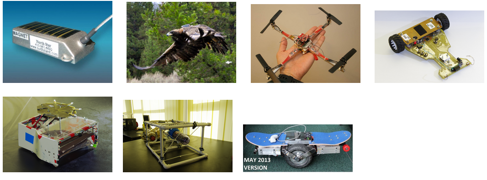
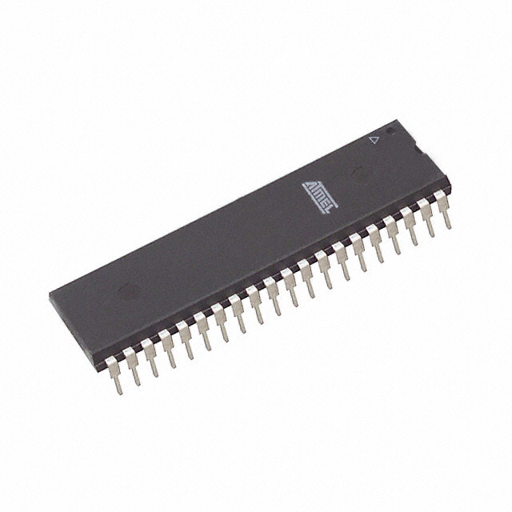
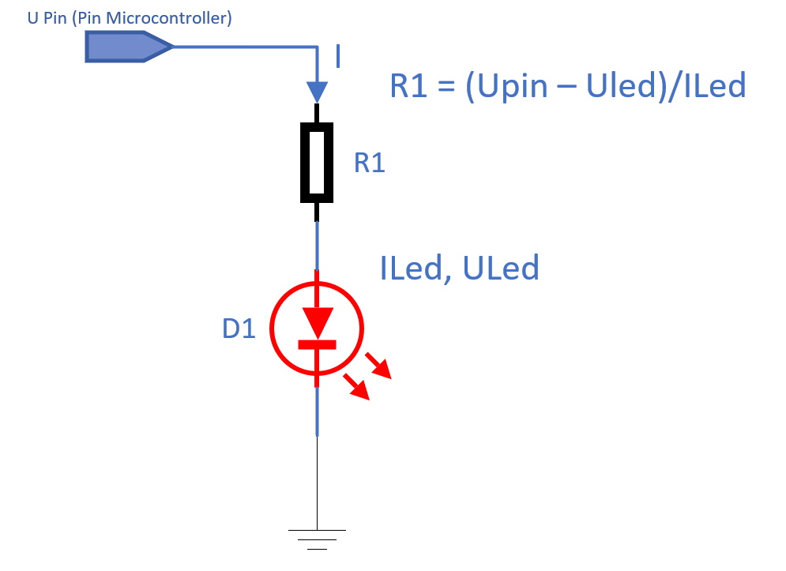
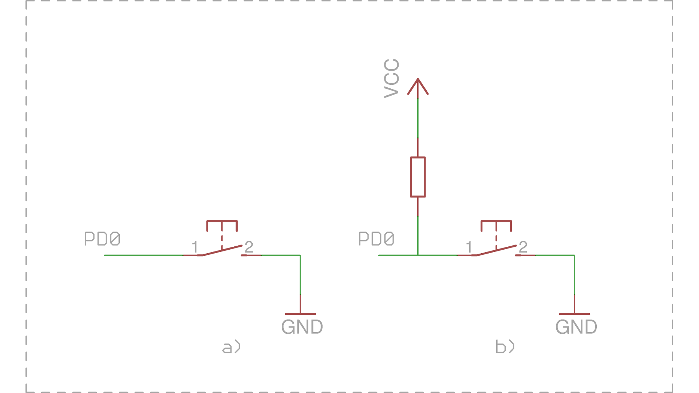

import TwoColumn from '@site/src/components/TwoColumn';
import CodeSnippet from '@site/src/components/CodeSnippet.tsx';
import * as snippets from '@site/snippets/code-snippets00.mdx';

# Laboratory 0: Introductory Applications

**Useful chapters from** **[ATmega324P Datasheet](https://ww1.microchip.com/downloads/en/DeviceDoc/Atmel-42743-ATmega324P_Datasheet.pdf)**

- 1. Pin Configurations - page 15
- 13. I/O-Ports - page 95

## 1. Introduction

### 1.1. Why?

**Q**: What are we doing here? Where is what we learn used? Is it really useful?

**A**: To answer briefly: "a lot," "everywhere," and "yes"; but let’s start with an example.

You’ve just built a new PC and installed RGB lighting on the RAM, fans, and case—a lot of it. Now comes the question: who "presses" the buttons to make the colors appear as set in the software? Should the CPU sit and handle changing the colors? That would be a waste of resources. This is where a microcontroller comes in! It's a smaller, simpler processor with a well-defined task within the system. In this case, its job is to control the RGB lighting throughout its lifetime.

### 1.2. What is a microcontroller (µC)?

TLDR: A computer in a chip. More specifically, it is an integrated circuit that includes a processing unit (CPU), memory (volatile RAM, non-volatile EEPROM, Flash, ROM), and various peripherals that allow it to communicate with the external environment.

### 1.3. µC in the Wild

We find them in various devices such as phones, household appliances, satellites, airplanes, factories, etc. There is a wide range of microcontrollers available, selected based on the application, primarily considering cost and energy consumption optimization for the device where the µC will be used.

    
Example projects

- [[1, 2] - Bird tracking](https://www.northstarst.com/)
- [[3] - Palm size quad-copter](http://www.rcgroups.com/forums/showthread.php?t=1335765)
- [4] - Line-following robot (Tare N' Bară)
- [5] - Soccer-playing robot (IronFoot)
- [6] - Submarine robot (R0X1)
- [[7] - Self-balancing skateboard](http://www.instructables.com/id/Easy-build-self-balancing-skateboardrobotsegway-/)

For more examples, you can start searching here: [https://www.hackster.io/projects/tags/microcontroller](https://www.hackster.io/projects/tags/microcontroller)

### 1.4. What’s Inside a µC?

- **Central Processing Unit** (µP core) with architectures of 8, 16, 32, or 64 bits
- Volatile data memory (**RAM**) and/or non-volatile memory (Flash or EEPROM)
- Non-volatile program memory (**Flash** or **EEPROM**)
- General-purpose digital input-output ports (**GPIO** - General Purpose Input Output)
- Serial communication interfaces (**USART**, **SPI**, **I2C**, PCM, **USB**, SDIO, etc.)
- Ethernet interfaces
- Interfaces for graphic displays (LVDS, **HDMI**, or other dedicated LCD control protocols)
- Timers (internal or used for generating periodic signals - e.g., PWM - or as a watchdog)
- Analog-to-digital and digital-to-analog converters (**ADC**, **DAC**), analog front-ends, and other circuits for analog signals
- Integrated voltage source
- Programming and debugging interface

**Peripherals** represent any internal or external device that connects to a computing system and extends its basic functionality. In the case of a microcontroller, several such peripherals are integrated directly into the chip (examples above). Although they do not resemble PC peripherals (monitor, graphics card, keyboard, mouse, etc.), without them, the microcontroller would not be able to interact with the outside world. Moreover, peripherals help connect more advanced components to the controller and provide functionalities similar to a PC system (internet connection, USB data line, graphic display, etc.).

## 2. Microchip (Atmel) AVR

Throughout the semester, we will work with microcontrollers from the AVR family by Microchip. These have an 8-bit Harvard architecture and a reduced instruction set (RISC).

### 2.1. ATmega324P

This is an 8-bit microcontroller from the megaAVR family, which we will use throughout the semester. Its registers and internal data bus are 8-bit wide.

 µC Specifications 

- 32 KB Flash (determines the maximum program size)
- 1 KB EEPROM
- 2 KB RAM
- 20 MHz maximum clock frequency
- Supply voltage between 2.7V and 5.5V
- 6 PWM channels
- 8 ADC channels with 10-bit resolution
- 4 digital I/O ports, each with 8 pins, totaling 32 I/O pins
- 3 timers (two 8-bit and one 16-bit)
- Serial communication interfaces: USART, SPI, TWI
- ISP programming interface and JTAG debugging interface

We will learn to configure its pins and interact with the external environment through code. This microcontroller has 40 pins (shown below), of which 5 are for power or auxiliary functions, while 32 are for I/O. It has four ports: A, B, C, and D.

:::note

For more details, you can always consult the [datasheet](https://www.microchip.com/downloads/en/DeviceDoc/Atmel-42743-ATmega324P_Datasheet.pdf) (the summarized technical documentation) of the microcontroller. :)

:::

### 2.2. Laboratory Board

[The Laboratory Board](https:*github.com/dantudose/PM-Board) is based on the [ATmega324P microcontroller](https:*ww1.microchip.com/downloads/aemDocuments/documents/OTH/ProductDocuments/DataSheets/ATmega164P-324P-644P-Data-Sheet-40002071A.pdf) and comes with the following features:

* LSM9DS0 - 9-axis inertial sensor (accelerometer, gyroscope, and magnetometer)
* MPL3115 - Barometric altimeter sensor
* Temperature and ambient light sensors
* 128x160 ST7735 color LCD display with SD card reader
* RGB LED
* 16x2 character LCD display
* GPIO LEDs and buttons
* JTAG and ISP connectors
* Programmable USB interface and data interface  

The laboratory board is a circuit that conveniently provides access to the µC’s pins and contains power, protection circuits, and possibly the µC programmer.

:::info

The programmer is a special chip, sometimes even another microcontroller, responsible for loading the code into the µC’s memory. We cannot directly connect the µC to a PC’s USB lines; we need an intermediary to "translate" that information.

:::

### 2.3. Development Board Pinout

**LCD Displays**

<TwoColumn 
  left={`    
    |  Character LCD  |  GPIO Pin  |
    |  --- | --- |
    | RS               |  PC0         |
    | RW               |  PC1         |
    | EN               |  PC2         |
    | D4               |  PC3         |
    | D5               |  PC4         |
    | D6               |  PC5         |
    | D7               |  PC6         |
    | Backlight        |  PC7         |
    `}
  right={`
|  Graphical LCD  |  GPIO Pin  |
|  --- | --- |
| CS               |  PB0        |
| RST              |  PB1        |
| A0               |  PB4        |
| SDA              |  PB5        |
| SCK              |  PB7        |
| Backlight        |  PA7        |
  `}
/>

<TwoColumn 
  left={`
    **I2C Sensors & Bus Addresses**

|  I2C          |  GPIO Pin       | Chip     |  Address |
|  --- | --- | --- | --- |
| I2C Enable   | PA6          |  LSM9DS0   |  0x1D (XM) 0x6B (G) |
| SCL          | PC0          | MPL3115A2  |  0x60                |
| SDA          | PC1          |            |                      |
  `}
  right={`
**SD Card**

|     	 |  GPIO Pin	 |
|  --- | --- |
|  CS	 |  PA2	 |
|  MOSI  |  PB5 	 |
|  MISO  |  PB6 	 |
|  SCK 	 |  PB7 	 |
`}
/>

<TwoColumn 
  left={`

    **RGB LED**

    ||  GPIO Pin	|
    |  --- | --- |
    |  Red	  |  PD5  |
    |  Green  |  PD7  |
    |  Blue	  |  PB3  |
  `}
  right={`

    **Miscellaneous**

|     	 |  GPIO Pin	|
|  --- | --- |
| Temperature Sensor  |  PA0  |
| Ambient Light Sensor |  PA1  |
| Buttons (BTN1 - 6)	|  PA5  |
| BTN 1	                |  PB2  |
| BTN 2	                |  PD6  |
| Speaker	            |  PD4  |
`}
/>

## 3. Let's get to work

### 3.1. Actuators and Transducers (Sensors)

To interface with the external environment, various electronic components are used, either as actuators (which modify the external environment's state) or as transducers/sensors (which are influenced by the external environment and provide information to the microcontroller about different parameters).

**Example Actuators**:

* Fans
* Sound indicators - buzzers
* Light indicators
* Heating resistors

:::important

Sometimes, an activation element is needed to power an actuator. For example, if we want to start a motor, the µC only sends a logical start command to a transistor, which then opens and allows a larger current to pass through (here, "large current" is relative compared to the few milliamps a µC can output).

:::

**Example Sensors**:

* Buttons
* Photoresistors - their electrical resistance is influenced by the amount of light
* Thermistors - their electrical resistance is influenced by temperature

:::important

Depending on the type of transducer, the signal might need processing before it can be read by the µC (signal conditioning). For example, a photoresistor must be used in a voltage divider or current source circuit, while a button can be connected directly to the microcontroller.

:::

#### 3.1.1. LEDs

LEDs - Light Emitting Diodes - emit light when they are forward biased. Do not confuse them with traditional light bulbs, as they operate in fundamentally different ways.

Depending on the semiconductors used in their construction and the plastic lens that acts as a dispersion lens and optical filter, LEDs can emit light in different colors. Do not confuse LEDs with bulbs! While light bulbs emit light by heating a tungsten filament to high temperatures, LEDs emit light by passing current through a semiconductor material (p-n junction). Unlike bulbs, which have an efficiency of less than 5% (most of the energy is lost as heat), LEDs have a much higher efficiency in converting electrical energy into light.

LEDs can be used as status indicators (often used in various devices to signal that a device is on and performing a function) or for illumination, where high-power LEDs are used. In the laboratory, LEDs are used to indicate the state of a pin.

##### Current Limiting Resistor Calculation

:::note

LEDs are diodes, so the current through them increases exponentially with the applied voltage.

:::

To use an LED as a status indicator for a pin (more specifically, to indicate the presence of voltage), the current through the LED must be limited. The simplest way to do this is by placing a resistor in series with the LED.

An LED is designed to operate at a nominal current (e.g., 10mA). The voltage drop at this current for low-power indicator LEDs is determined by the LED’s chemistry (which also determines its color). In the laboratory, because we are using LEDs with such low current requirements, we can power them directly from the logic pins of the µC.

The circuit used is as follows:

**Solution**: If the microcontroller operates at 5V and we want to use a red LED at 10mA, with a voltage drop of 1.7V as specified by the manufacturer, we need to use a 330-ohm resistor.

#### 3.1.2. Buttons

The simplest way for a user to interact with a microcontroller is by using buttons. The correct way to connect a push-button in this laboratory is shown in the diagram below:

Connecting a push-button: a) incorrect, with floating input, b) correct, with pull-up resistor

**a)** Shows a button connected to pin PD0 of the µC. When the button is pressed, the PD0 input will be connected to GND, meaning it will be in the logic “0” state. This connection method is incorrect because when the button is not pressed, the input is in an **undefined state** (as if left floating), not being connected to either GND or Vcc! This state is called **high impedance state**. In practice, if we were to read the value of the pin now, it could randomly be read as 1 or 0 depending on environmental conditions. For example, if we bring a finger close to the input, the reading might be 1, and if we move it away, the reading might be 0.

**b)** Shows the correct way to connect the button, using a **pull-up resistor** between the input pin and Vcc. This resistor ensures that the input remains in the logic “1” state when the button is not pressed by “pulling up” the potential of the line to Vcc. Alternatively, a **pull-down resistor** (connected to GND) can be used, in which case the input is kept in the logic “0” state when the button is not pressed.

**In the laboratory**: To save external space, in the ATmega328P µC, these resistors are built into the integrated circuit. Initially, they are disabled and can be activated through software.

### 3.2. Working with Registers

This can be considered the most important step when using a µC. We must learn how to configure the µC internally so that it performs the functions we desire. In this laboratory, we will configure the pins to function as I/O: some pins will read whether there is voltage on them (input), while others will output 0 volts or 5 volts depending on our software commands.

To clarify the terminology: when we say **we set a register** or write to a register, we are not referring to the general-purpose registers in the processor that you may have worked with in IOCLA. **We are referring to memory addresses** reserved in the µC. Let’s repeat together: "By register, we mean a memory address." Practically speaking, how things work "under the hood" is that these bytes have physical connections, and if we write a bit of 1 or 0 in certain positions, we activate or deactivate components in the µC.

Whenever you need to configure a peripheral, the best source to find the exact settings and their functions is always the [datasheet](http://www.microchip.com/downloads/en/DeviceDoc/Atmel-42743-ATmega324P_Datasheet.pdf) of the µC. Since it is not convenient to write in code like `*(0x04) = 0b0000 0001`, µC manufacturers provide libraries ([avr-libc](https://www.nongnu.org/avr-libc/user-manual/modules.html)) that give names to these addresses. The following cheat sheet shows how to configure a specific bit at a certain address using macros (which are considered best practice).

:::info

To write a value into a register, you can assign a value directly; however, this method does not make the code very easy to understand. *Our recommendation* is to use bit masks (`(1 << x)`) or the `_BV(x)` macro. We also recommend using the pin name instead of its index, as the names are indicative of their function (for example, in the `ADCSRA` register of the analog-to-digital converter, the `ADEN` bit is the enable bit). The pin names, like the registers, are already defined in avr-libc.

:::

-----

| Operation | Syntax |
|  --- | --- |
| Set bit to 1 |<CodeSnippet code={snippets._01_set1} inline={true} />|
| Set bit to 0 |<CodeSnippet code={snippets._02_set0} inline={true} />|
| Toggle bit |<CodeSnippet code={snippets._03_toggle} inline={true} />|
| Read bit |<CodeSnippet code={snippets._04_read} inline={true} />|

Example: Working with registers

<CodeSnippet code={snippets._05_set_not_rec} language="c" />

<CodeSnippet code={snippets._05_set_rec} language="c" />

For more details about working with bits in registers, refer to the tutorial section on the [wiki](https://ocw.cs.pub.ro/courses/pm/tutorial/biti).

Don't worry, we will have plenty of lab sessions to get used to working with registers and configuring the µC. We encourage you to put in some effort now at the beginning for an easier journey throughout the semester.

### 3.3. I/O Registers

For this lab, we have spared you from searching through the datasheet, which can seem complicated at first, and have summarized the memory addresses (registers) you need to modify to complete this lab.

The ATmega324 microcontroller offers 4 I/O ports, each with 8 pins. Internally, each port has three 8-bit registers that allow the user to control *data flow at the pin level*: you can write/read data to/from the respective port. These three registers are:
* **`DDRn`** - *Data Direction Register*
  * Sets the direction of the port pins
  * If bit *x* is **0**, pin *x* is **input**
  * If bit *x* is **1**, pin *x* is **output**
* **`PORTn`** - *Data Register*
  * Sets the output values of the pins or enables/disables pull-up resistors
  * If bit *x* is **0**:
    * If pin *x* is **output**, it will be **LOW**
    * If pin *x* is **input**, the pull-up resistor will be **disabled**
  * If bit *x* is **1**:
    * If pin *x* is **output**, it will be **HIGH**
    * If pin *x* is **input**, the pull-up resistor will be **enabled**
* **`PINn`** - *Input Pins Address*
  * If the pin is **input**, we can read data from the respective port
    * If pin *x* is **LOW**, then bit *x* will be **0**
    * If pin *x* is **HIGH**, then bit *x* will be **1**
  * If the pin is **output**, we can toggle it automatically
    * If we write **1** to bit *x*, the corresponding bit in `PORTn` will automatically be inverted (**toggle** function)

*n* can be A, B, C, or D, depending on the selected port. *x* can be between 0 and 7.

A detailed description of the ports and their corresponding registers can be found in the ATmega324 datasheet, in the *I/O Ports* chapter.

#### 3.3.1. Example of Output Handling

Let's assume we have an LED connected to pin 1 of port B (called `PORTB1` or `PB1`). To turn the LED on or off, follow these steps:
* Configure pin `PB1` as an output:
  * Bit 1 (`PB1`) in the `DDRB` register should be set to 1
  * `DDRB |= (1 << PB1);`
* To turn the LED on, set pin `PB1` to HIGH:
  * Bit 1 (`PB1`) in the `PORTB` register should be set to 1
  * `PORTB |= (1 << PB1);`
* To turn the LED off, set pin `PB1` to LOW:
  * Bit 1 (`PB1`) in the `PORTB` register should be set to 0
  * `PORTB &= ~(1 << PB1);`

#### 3.3.2. Example of Input Handling

Let's assume we have a button connected to pin 4 of port D (called `PORTD4` or `PD4`), using the correct connection from case **b)** shown earlier. To determine the button's state (pressed or released), follow these steps:
* Configure pin `PD4` as an input:
  * Bit 4 (`PD4`) in the `DDRD` register should be set to 0
  * `DDRD &= ~(1 << PD4);`
* To determine whether the button is pressed, read the value of the pin it is attached to. It will be 1 when the button is released and 0 when the button is pressed:
  * Read bit 4 (`PD4`) in the `PIND` register:
  * `char val = PIND & (1 << PD4);`

## 4. Developing Programs for AVR

Development and Compilation without PlatformIO

### 4.1. Development and Compilation

For program development, we can use any text editor.

In the labs, we will write C code, not assembly (AVRASM), using the [avr-gcc](https://gcc.gnu.org/wiki/avr-gcc) compiler. This can be used on both Linux/Unix and Windows ([WinAVR](http://winavr.sourceforge.net/)). WinAVR includes the C library, avr-libc, which must be installed separately on Linux/Unix systems.

Although our microcontroller is 8-bit, in C code, we can use integer variables of 16/32/64 bits and even floating-point numbers. The compiler handles translating instructions into assembly code that operates on 8-bit architecture.

As with Linux systems, to program AVR, we need some utilities: the avr-gcc compiler, avr-libc, and AVRDUDE. To install these utilities, Homebrew is recommended. Use the following commands:

<CodeSnippet code={snippets._06_mac_install} language="bash" />

To run on M1/M2/M3 processors, you need to install at least version 11 of avr-gcc.
More examples can be found [here](https://wellys.com/posts/avr_c_macos/).

### 4.2. Programming the Microcontroller

A microcontroller can be programmed using various methods, such as serial interface programming, an ISP programmer (In-System Programming) using the SPI interface, or a bootloader.

In this lab, we will use the last method because it eliminates the need for additional external components to upload the hex file. A **bootloader** is a program preloaded (using, for example, an ISP programmer) at the end of the microcontroller's program memory. Execution of uploaded code will start from the boot section. The drawback of this method is the memory space occupied by the bootloader.

Using a bootloader requires meeting a condition at the microcontroller’s startup. On lab boards, it runs on each RESET, but we can set any condition detectable by the processor (for example, whether a button is pressed or not). Some microcontrollers have a dedicated ROM for the bootloader, factory-installed (e.g., STM32).

To upload the program to the microcontroller, we must use a utility on the computer. Below is an example of using the **avrdude** utility on Linux and Windows:

<CodeSnippet code={snippets._07_upload_code} language="c" />

### 4.3. PlatformIO

For an all-in-one **toolchain and IDE** solution, install [PlatformIO](https://platformio.org/). After installing the PlatformIO extension in VSCode, create a new project targeting ATmega324P as the platform/microcontroller and add the following line to **platformio.ini**:

<CodeSnippet code={snippets._08_urclock} language="c" />

PlatformIO alternative

#### 4.3.1 Alternative to PlatformIO: Installing the avr-gcc Toolchain Separately

Alright, so you're a hardcore software developer and want to install the toolchain directly using your favorite IDE (who am I kidding, you're working directly in Vim). You have that option too, but it comes with a few headaches. If you want to install just the toolchain, without an IDE, you will need **avr-gcc**, **make**, and **avrdude** to compile and program the development board. We recommend the following installation guides:
* [ Linux](https://baremetalmicro.com/tutorial_avr_toolchain/03-Install-on-Ubuntu-Linux.html)
* [ Windows](https://tinusaur.com/guides/avr-gcc-toolchain/)
* [ Mac](https://wellys.com/posts/avr_c_macos/)

:::info

It is possible that the default installation of avrdude does not support the **urclock** bootloader on the board, and you may receive an error message when running **make upload**. To fix this issue, you need to install avrdude 7.2-arduino.1 (or install PlatformIO directly, which comes with the correct version of avrdude).

:::

We also recommend using an IDE for code development. If you prefer VSCode (without the PlatformIO extension), check out this [tutorial](https://www.youtube.com/watch?v=LE7-uzhlGVM&ab_channel=WhiteHeart).

:::warning

**Warning**: Support for the `urclock` programmer (also known as `urprotocol`), used by our boards, [was only added](https://github.com/avrdudes/avrdude/blob/main/NEWS) in `avrdude >= 7.1`. Make sure you install a recent version (e.g., **7.3**)! Notably, Ubuntu 22.04 only provides version 6.3: [download the precompiled version from GitHub](https://github.com/avrdudes/avrdude/releases) or use PlatformIO if you do not meet this minimum version requirement! Of course, if you download the binary manually, don't forget to make it executable and place it somewhere in your PATH (e.g., `/usr/local/bin/` on Linux or `C:\Windows\System32` on Windows, plus manually copying `avrdude.conf` if needed).

:::

### 4.4. Hello World

We will write a program that turns an LED on and off at 500 ms intervals. The targeted LED is the green one on the laboratory board. This is done by modifying the voltage of one of the microcontroller's pins, in our case, pin 7 of port D (`PD7`).

<CodeSnippet code={snippets._09_hello} language="c" />

To compile with PlatformIO, press **Ctrl+Alt+B**, then **Ctrl+Alt+U** to upload.

 Using a Custom Makefile for Compilation 

If you have installed the toolchain separately, you need to use the following Makefile:

<CodeSnippet code={snippets._10_makefile} language="c" />

:::info

The compiler used is **avr-gcc**. The flags have the following meanings:
* `-mmcu`: Informs the compiler about the type of microcontroller for which the code should be generated.
* `-DF_CPU=12000000`: Defines the macro `F_CPU`, which indicates the clock frequency of the microcontroller.
* `-Os`: Optimizes the program for memory usage (quite useful given the limited memory on the chip).
* `-Wall`: Enables all warning messages.

The file to be programmed onto the board must be in *ihex* format. Therefore, it is necessary to extract the data and code sections from the compiled ELF file and integrate them into an *ihex* file. This step is performed using the **avr-objcopy** utility.

The **avr-size** command shows how much memory different sections of the program occupy. Keep in mind that in the SRAM memory for data, besides the `.data` section, the stack will also be placed. To run the program on the ATmega324microcontroller, the `.text` section must be smaller than 32 KB, and the `.data` section must be smaller than 2 KB.

:::

The result of the compilation is the **main.hex** file. This file is then uploaded to the microcontroller using the **upload** rule.

## 5. Exercises

**Task 0** Let's start by verifying the setup.

* Install your preferred/required IDE and run the Hello World example on the development board in the lab.

**Task 1**
* Modify the Hello World example so that the lit LED is red instead of green. Hint: Find the pin and port to which this LED (part of the RGB LED) is connected in the [board schematic](https://raw.githubusercontent.com/dantudose/PM-Board/main/Hardware/schematic.pdf) / [board documentation on GitHub](https://github.com/dantudose/PM-Board/tree/main?tab=readme-ov-file#board-pinout).
  
  :::note

   The RGB LED has a common anode, so writing a logical 1 to the corresponding GPIO pin will turn off the LED.

   :::

**Task 2**
* Modify the Hello World example so that the LED changes color when Button 1 (PB2) is pressed.
  * Keep the green LED on by default.
  * Configure the registers to set PB2 as an input.
  * Configure the LED to add another color (red/blue) when the button is pressed. (Don't forget to enable the internal pull-up resistor of the µC for PB2.)

**Task 3**
* Starting from the application created in Task 2, change the functionality of Button 1 to cycle through LED colors on successive presses (first press - red, second press - green, third press - blue, and so on).
* Use Button 2 to toggle between a blinking (flashing) LED and a solid-on state (one press - blinking, second press - always on, next press - blinking again, etc.).

## 6. Useful Links

* [AVR Freaks Community](http://www.avrfreaks.net/)
* [AVR libc Documentation](http://www.nongnu.org/avr-libc/user-manual/modules.html)
* [AVR GCC Compiler](https://gcc.gnu.org/wiki/avr-gcc)
* [Introductory Details on AVR Programming (Blog)](http://hackaday.com/2010/10/23/avr-programming-introduction/)
* [How LEDs Work](http://electronics.howstuffworks.com/led.htm)
* [PM Development Board Schematic](https://raw.githubusercontent.com/dantudose/PM-Board/main/Hardware/schematic.pdf)

