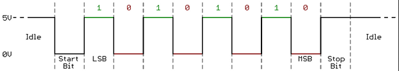

import TwoColumn from '@site/src/components/TwoColumn';
import CodeSnippet from '@site/src/components/CodeSnippet.tsx';
import * as snippets from '@site/snippets/code-snippets01.mdx';
import Tabs from '@theme/Tabs';
import TabItem from '@theme/TabItem';

# Laboratory 1: USART. Debugging

As in all engineering work, bugs can and will appear in embedded systems. Under operating conditions, it is crucial to have a means of communication with the embedded device. To get an overview of the possible debugging methods, we will first provide a brief introduction, then study in detail the USART serial interface, commonly used for serial communication between two devices.

## 1. What is Different from Regular Software Debugging?

The reason embedded debugging is more challenging than regular software debugging stems from several issues:

* Embedded systems are much more difficult to debug because dedicated hardware debugging tools (Software, IDE, Lauterbach, etc.) are much more expensive and harder to use than standard software debugging.
* Using a generic debugger (e.g., Remote GDB) comes with a series of issues. Generic debuggers require a network stack or protocols compatible with the used hardware. Even if we implement such a stack, we cannot be sure that it works perfectly.
* Even if you had a specialized debugger (such as a Lauterbach probe), you would likely need specialized debugger configurations to work with your hardware (e.g., Practice Scripting Language for Lauterbach T32).
* Invasive debugging can affect the behavior of your code—consider RTOS (real-time operating systems), SMP (multiprocessor systems), or your circuit (e.g., modifying the circuit to measure current intensity).
* Early-stage hardware may have design errors that impact the debugging process.
* Even printing error messages might not work, as sometimes you need to implement such a function yourself, which could contain bugs.

Despite these challenges, debugging principles remain the same as in high-level software: you must compare the intended system behavior (code/circuit) with what the system actually does.

## 2. Required Tools

Hardware-level visibility is achieved through some form of Input/Output (if available):

* LED debugging - checking true/false states.
* **Messages via the serial interface / USART - debugging through USART, Bluetooth, etc.**
* Advanced debuggers for displaying and modifying memory/registers (see JTAG below).
* Loopback testing (connecting outputs to inputs) can provide information on how commands are being sent to external devices.

Measurement tools:

* Multimeters (for static values)
  * **Resistance**: Simply connect a circuit component between the probes.
  * **Voltage**: Connect in parallel—positive probe (red) to the higher potential point, negative probe (black) to the lower potential point. To measure the potential at a single point: connect the negative probe to GND and the positive probe to the desired point.
  * **Current**: Connect the multimeter in series with the circuit you want to check. You must place the red probe on the wire of a component and the black probe on the next conductor. The multimeter acts as if it were a wire in your circuit. If you disconnect the multimeter, the circuit will not function.
  * **Always start by setting the multimeter scale to the maximum, then adjust it progressively to achieve the most precise measurement.**
  * **To check diode polarity**: Select the diode test mode. If you place the negative probe on the anode and the positive probe on the cathode, the multimeter will beep or display a voltage drop across the p-n junction.
  * **To check for short circuits/connectivity**: Use the buzzer mode if available in resistance measurement mode—if the device emits a sound, it means there is a short circuit/connection between those two points.

* Oscilloscope
* Logic analyzers (for digital signals)
* Protocol analyzers (for embedded protocols such as I2C, SPI, etc.)
* JTAG-based debuggers - can offer very advanced functions: reading/modifying memory, interacting with the kernel, stopping the system clock, etc.

### Example Debugging Workflow

An example debugging workflow could be as follows:
* **Double-check the datasheet and schematic.** Ensure you are accessing the correct registers. Another issue could be incorrect wiring between peripherals and pins.
* **Initially, check if debugging is possible using debug messages and/or serial interface messages.**
* **If an Ethernet stack is available on the device**, consider using SSH, NFS, etc., for debugging via messages.
* **If no network stack is available, check for access to simpler protocols such as UART.** Test by connecting a peripheral via UART, such as a PC, Bluetooth module, LCD, etc.
* **In extreme cases or for very simple programs**, when none of the above options are available, LED debugging can also be used.
* **Isolate the issue using measurement tools**: multimeters, oscilloscopes, logic analyzers.
* **If the device supports hardware debuggers (JTAG, Lauterbach, etc.), using them is often the most efficient debugging method.**

## 3. USART Serial Interface

The serial interface is the easiest way to communicate with your microcontroller for reading data or sending commands. From the microcontroller's perspective, serial communication relies on only **two data lines**:
* A **transmission line**, labeled **Tx**.
* A **reception line**, labeled **Rx**.

Communication is full-duplex, meaning transmission and reception can occur simultaneously.

Asynchronous data transmission occurs in **frames**, with each frame consisting of multiple bits, following the format shown in the figure below.

A **start bit** is transmitted first, followed by a data word. Next is an **optional parity bit**, used for basic error detection, followed by **one or two stop bits**.

The ATmega324P microcontroller includes two **USART** (Universal Synchronous-Asynchronous Receiver/Transmitter) peripherals for serial communication. During the initialization of this peripheral, the following steps must be performed:
* Selecting the data transmission speed - the baud rate (common values: 9600, 19200, 38400, 57600, 115200).
* Choosing the frame format (number of data bits, stop bits, and whether a parity bit is included).
* Enabling data transmission and reception on the `RX` and `TX` lines.

:::tip

**Baud rate** is the number of symbols/pulses per second in the signal. Essentially, it represents the transmission speed, and it is crucial that both the transmitter and receiver use the same baud rate for accurate data transmission. One of the most common issues with USART configured in asynchronous mode is a mismatch in baud rate settings between the transmitter and receiver. This discrepancy results in incorrect data reception (e.g., the transmitter sends the character 'a', but the receiver receives the character '&').

:::

:::warning

For two devices, in this case, the PC and the lab board, to communicate via USART in asynchronous mode, they must be configured **identically**. If the board is configured with a baud rate of 115200, 9 data bits, 1 stop bit, and no parity, then the PC must be configured **exactly the same** for communication to occur.

:::

### 3.1 Registers

:::info

A complete description of:
* The three control registers.
* The baud rate register.
* The transmission/reception buffers.
Can be found in the [Atmega324P Datasheet](https://ww1.microchip.com/downloads/en/DeviceDoc/Atmel-42743-ATmega324P_Datasheet.pdf) in <color red>Chapter 21.12</color>.
The registers have an 'n' at the end, distinguishing between multiple USART peripherals that may exist on a microcontroller (on ATmega324P, 'n' will be either 0 or 1, corresponding to USART0 and USART1).

:::

#### USART Data Register n (UDRn)

`RXB` and `TXB` are the reception and transmission buffers, respectively. They use the *same I/O address*. Thus, `RXB` is accessed by reading from `UDRn`, and `TXB` by writing to `UDRn`. The transmission buffer can only be written to when the `UDRE` (*USART Data Register Empty*) bit in the `UCSRnA` register is set to 1. Otherwise, writes will be ignored.

#### USART Control and Status Register n A (UCSRnA)

`UCSRnA` is the status register for the communication controller. The most important bits are:
* **RXCn** – **Receive Complete** – becomes 1 when there is received but unread data. It resets automatically when the reception buffer is empty.
* **TXCn** – **Transmit Complete** – becomes 1 when the transmission buffer is empty.
* **UDREn** – **Data Register Empty** – becomes 1 when the transmission buffer can accept new data.

#### USART Control and Status Register n B (UCSRnB)

`UCSRnB` is a control register. The important bits are:
* **RXCIEn** – **Receive Complete Interrupt Enable** – when set to 1, the communication controller generates an interrupt when data is received.
* **TXCIEn** – **Transmit Complete Interrupt Enable** – when set to 1, the communication controller generates an interrupt when the transmission buffer is empty.
* **UDRIEn** – **Data Register Empty Interrupt Enable** – when set to 1, the communication controller generates an interrupt when the transmission buffer can accept more data.
* **RXENn** – **Receiver Enable** – if 0, data cannot be received.
* **TXENn** – **Transmitter Enable** – if 0, data cannot be transmitted.
* **UCSZn2** – together with `UCSZ1` and `UCSZ0` in the `UCSRC` register, selects the size of a data word.

#### USART Control and Status Register n C (UCSRnC)

`UCSRnC` is another control register. Important bits:
* **UMSELn** – **Mode Select** – 0 for asynchronous operation, 1 for synchronous operation.
* **UPMn1, UPMn0** – **Parity Mode** – Since there are two bits, they can take four possible values, as shown in the table below:

* **USBSn** – **Stop Bit Select** – 0 for one stop bit, 1 for two stop bits.

* **UCSZn1, UCSZn0** – together with `UCSZn2` in the `UCSRnB` register, selects the data word size.

#### USART Baud Rate Registers (UBRRn)

`UBRRn` is the register that sets the **baud rate** and has 12 bits. The first 4 bits are in `UBRRnH`, while the remaining 8 are in `UBRRnL`. The value written in `UBRRn` depends on the processor clock frequency and the desired baud rate.

The table below is used for clock speeds of 8MHz, 11.0592MHz, and 14.7456MHz. Our board runs at 12MHz, so we can find the corresponding baud rate value [here](https://cache.amobbs.com/bbs_upload782111/files_22/ourdev_508497.html) or calculate it using the formula:  
**(F_CPU / (UART_BAUD_RATE * 16) - 1)**,  
where F_CPU is the clock frequency, and UART_BAUD_RATE is the chosen baud rate (e.g., 4800, 9600, 14400).

:::warning

It is recommended to select a baud rate that can be derived exactly from the clock frequency. Otherwise, a tolerance is defined (the maximum baud rate error) within which communication remains acceptable. If you want to explore this topic further, check out [this resource](https://www.allaboutcircuits.com/technical-articles/the-uart-baud-rate-clock-how-accurate-does-it-need-to-be/).

:::

:::warning

To set the baud rate, you can also use the **util/setbaud.h** library, designed to simplify the process. You need to set the processor clock frequency. More details and usage examples can be found [here](https://www.nongnu.org/avr-libc/user-manual/group__util__setbaud.html).

:::

### 3.2 Usage Example

<CodeSnippet code={snippets._01_example_usart} language="c" />

#### Writing 16-bit Values

** `(3 << x)` **  
For configuration bits that are always located next to each other, a mask with multiple bits shifted by the rightmost index is used:  
`(3 << UCSZ00)` replaces `(1 << UCSZ01) | (1 << UCSZ00)`

** `(1 << x) | (1 << y)` **  
Most of the time, we will create composite masks, applying them to an I/O register simultaneously.  
**Warning!** You can only compose masks for the same operation. You cannot apply an *OR* mask at the same time as an *AND* mask, as this would lead to incorrect results.

---

## 4. Exercises

<Tabs>
  <TabItem value="lab_work" label="Lab Work">
  
[Lab Skeleton](lab1-usart.zip)

### **Task 1**

Using the provided lab skeleton, configure **USART0** with the following parameters:  
- **Baud rate:** 28800  
- **Data bits:** 8  
- **Stop bits:** 2  
- **Parity:** None  

Transmit the message **"Butonul 1 a fost apasat"** to the PC when **button 1 (PB2)** is pressed.

:::warning

Definitions in **AVR Libc** that require clock frequency calculations depend on the `F_CPU` parameter, provided by the compiler.  
Since we are using **PlatformIO**, don't forget to set the **12MHz clock** in `platformio.ini`  
([see the official documentation](https://docs.platformio.org/en/stable/platforms/atmelavr.html)):

<CodeSnippet code={snippets._02_f_cpu} language="c" />

:::

:::info

To specify the **baud rate** for the serial console in **VSCode with PlatformIO**, use the following variable in `platformio.ini`:

<CodeSnippet code={snippets._03_speed} language="c" />

To see messages typed in the serial monitor:

<CodeSnippet code={snippets._04_echo} language="c" />

:::

---

### **Task 2**

Using the lab skeleton, implement a new function:

<CodeSnippet code={snippets._05_func} language="c" />

This function should accept the following commands received via USART:

- **"on"** – turn on the **RGB LED** in **white** color.
- **"off"** – turn off the **RGB LED**.
- **"red"**, **"green"**, or **"blue"** – set the LED to the specified color.

#### **RGB LED Pin Configuration**
- **Red** - PD5
- **Green** – PD7
- **Blue** – PB3

---

### **Task 3**

Send your **name** via the serial interface.  
Using the **"morse_alphabet"** from the lab skeleton and the **buzzer**, generate the Morse code representation of your name.

---

### **Bonus Task: USART-Controlled Traffic Light**

Implement a **traffic light** system controlled via **USART** using the **RGB LED** from **Task 1**.

#### **Behavior**
- The LED remains **red** by default.
- When the **"pedestrian"** message is received via USART:
  - The LED turns **yellow** for **2 seconds**.
  - The LED turns **green** for **5 seconds**.
  - The LED returns to **red** until a new **"pedestrian"** message is received.
- If a message **other than "pedestrian"** is received, send **"incorrect command"** via USART.
- During color transitions, new USART messages should be **ignored**.

<CodeSnippet code={snippets._06_bonus} language="c" />

</TabItem>

<TabItem value="hw" label="Homework">
    Homework Exercices on Tinkercad
  </TabItem>
</Tabs>
