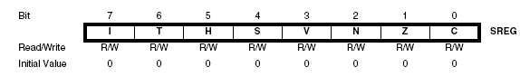

import TwoColumn from '@site/src/components/TwoColumn';
import CodeSnippet from '@site/src/components/CodeSnippet.tsx';
import * as snippets from '@site/snippets/code-snippets01.mdx';
import Tabs from '@theme/Tabs';
import TabItem from '@theme/TabItem';


# Laboratory 2: Interrupts, Timers

### **Useful Chapters from** [Datasheet ATmega324](https://ocw.cs.pub.ro/courses/_media/pm/doc8272.pdf)
* **1. Pin Configurations**
  * Section 1.1 - Page 2
* **7. AVR CPU Core**
  * Section 7.3 - Page 11
  * Section 7.7 - Page 16
* **12. Interrupts**
  * Table 12-1 - Page 61
* **13. External Interrupts**
  * Section 13.1 - Page 67
  * Sections 13.2.4-13.2.9 - Page 69
* **16. 16-bit Timer/Counter1 and Timer/Counter3 with PWM**
  * Sections 16.1-16.3 - Page 111
  * Section 16.5 - Page 117
  * Section 16.7 - Page 120
  * Sections 16.9.1-16.9.2 - Page 123
  * Section 16.11 - Page 132

:::warning 
The chapters are from [Datasheet ATmega324](https://ocw.cs.pub.ro/courses/_media/pm/doc8272.pdf), a document available on the **desktop of the laboratory computers**.  
The chapter order might be different in other versions of the datasheet!
:::

---

## **Objective**

This lab aims to familiarize you with **hardware interrupts** and **timers** in the ATmega324 microcontroller.  
In this session, we will use timers **only for counting**, without generating PWM signals.  
PWM functionality will be explored in the **next laboratory**.

---

## **1. Interrupts**

A **hardware interrupt** is a synchronous or asynchronous signal from a peripheral indicating the occurrence of an event that the processor must handle.  
Handling an interrupt **suspends the normal execution flow** of a program and triggers the execution of an **Interrupt Service Routine (ISR).**

### **Why Use Interrupts?**
Interrupts eliminate the need for **polling loops** where a processor constantly checks for an event from a peripheral.  
By using interrupts:
- Peripherals can notify the processor **only when necessary**.
- The processor is **free** to execute other tasks **until an event occurs**.
- The program executes **more efficiently**.

### **Handling Interrupts**
Before executing an **ISR**, the processor **saves its current state**:
- **Program Counter (PC)**
- **Status registers**
- **Variables affected by the ISR execution**

This information is stored in **memory**, typically a **stack**.  
Once the ISR completes, the **previous state** is restored, and the **main program resumes** from where it was interrupted.

---

## **Interrupt Vector Table (IVT)**

To associate an interrupt with a specific **ISR function**, the processor uses an **Interrupt Vector Table (IVT)**, shown in the diagram below.

Each interrupt is assigned a **fixed memory address** where its **ISR function** is located.  
When an interrupt occurs, the processor jumps to its corresponding **ISR address** in the IVT.

**Interrupt Priority:**  
- **Lower addresses → Higher priority**
- Interrupts at the **beginning of the IVT** are handled **first**.

---

## **Interrupt Vector Table for ATmega324**

| Vector No. | Program Address | Source | Interrupt Definition |
|------------|----------------|--------|----------------------|
| 1  | 0000  | RESET         | External Pin, Power-on Reset, Brown-out Reset, Watchdog Reset, and JTAG AWR Reset |
| 2  | 0002  | INT0          | External Interrupt Request 0 |
| 3  | 0004  | INT1          | External Interrupt Request 1 |
| 4  | 0006  | INT2          | External Interrupt Request 2 |
| 5  | 0008  | PCINT0        | Pin Change Interrupt Request 0 |
| 6  | 000A  | PCINT1        | Pin Change Interrupt Request 1 |
| 7  | 000C  | PCINT2        | Pin Change Interrupt Request 2 |
| 8  | 000E  | PCINT3        | Pin Change Interrupt Request 3 |
| 9  | 0010  | WDT           | Watchdog Time-out Interrupt |
| 10 | 0012  | TIMER2_COMPA  | Timer/Counter2 Compare Match A |
| 11 | 0014  | TIMER2_COMPB  | Timer/Counter2 Compare Match B |
| 12 | 0016  | TIMER2_OVF    | Timer/Counter2 Overflow |
| 13 | 0018  | TIMER1_CAPT   | Timer/Counter1 Capture Event |
| 14 | 001A  | TIMER1_COMPA  | Timer/Counter1 Compare Match A |
| 15 | 001C  | TIMER1_COMPB  | Timer/Counter1 Compare Match B |
| 16 | 001E  | TIMER1_OVF    | Timer/Counter1 Overflow |
| 17 | 0020  | TIMER0_COMPA  | Timer/Counter0 Compare Match A |
| 18 | 0022  | TIMER0_COMPB  | Timer/Counter0 Compare Match B |
| 19 | 0024  | TIMER0_OVF    | Timer/Counter0 Overflow |
| 20 | 0026  | SPI_STC       | SPI Serial Transfer Complete |
| 21 | 0028  | USART0_RX     | USART0 Rx Complete |
| 22 | 002A  | USART0_UDRE   | USART0 Data Register Empty |
| 23 | 002C  | USART0_TX     | USART0 Tx Complete |
| 24 | 002E  | ANALOG_COMP   | Analog Comparator |
| 25 | 0030  | ADC           | ADC Conversion Complete |
| 26 | 0032  | EE_READY      | EEPROM Ready |
| 27 | 0034  | TWI           | Two-Wire Serial Interface |
| 28 | 0036  | SPM_READY     | Store Program Memory Ready |
| 29 | 0038  | USART1_RX     | USART1 Rx Complete |
| 30 | 003A  | USART1_UDRE   | USART1 Data Register Empty |
| 31 | 003C  | USART1_TX     | USART1 Tx Complete |
| 32 | 003E  | TIMER3_CAPT   | Timer/Counter3 Capture Event |
| 33 | 0040  | TIMER3_COMPA  | Timer/Counter3 Compare Match A |
| 34 | 0042  | TIMER3_COMPB  | Timer/Counter3 Compare Match B |
| 35 | 0044  | TIMER3_OVF    | Timer/Counter3 Overflow |

---

From the table above, besides **internal component interrupts** (timers, serial interfaces, analog-to-digital converters), there are also **external peripheral interrupts**:  
✅ **INT0-INT2**  
✅ **PCINT0-PCINT3**  

The **difference** between these two types of external interrupts lies in their capabilities and level of granularity.

### **INTn Interrupts**
- Signals for **INTn** interrupts come from:
  - **Port D** (pins 2, 3)
  - **Port B** (pin 2)
- They can trigger an interrupt:
  - On **rising** or **falling edge**
  - Or on **level 0**, depending on the configuration.

### **PCINTn Interrupts**
- **PCINTn** interrupts trigger on **both edges** (hence the name **Pin Change INTerrupt**).
- **8 pins are multiplexed** onto a **single interrupt**.
- While **PCINT signals** can be individually enabled, the exact pin that triggered the interrupt must be determined by checking the **PINn register**.
- **Multiple simultaneous pin changes cannot be distinguished.**

:::warning 
For **pin change interrupts**, do not confuse the **interrupt vector (e.g., PCINT0)** with the **actual interrupt (e.g., PCINT0 (PA0))**.  
The mapping between vectors and interrupts is found in **Section 30, Page 555** of the [datasheet](https://ocw.cs.pub.ro/courses/_media/pm/doc8272.pdf).
:::


## **External Interrupt Pins on ATmega324**


:::tip
When an interrupt occurs, besides saving the state, the processor **disables** interrupts, and upon returning from the interrupt handler, it **re-enables** them.  
Interrupts can also be manually re-enabled **within the handler** (e.g., if we are inside a handler for receiving a frame over a serial interface and want to enable a timer interrupt).
:::

---

## **1.1. Using Interrupts**

To enable an interrupt, follow these steps:

### **1️⃣ Enable the global interrupt mechanism**
Interrupt handling must be explicitly enabled (bit **I - Global Interrupt Enable** in the `SREG` register).  
To set and clear this bit, use the following helper functions:

```c
// Enable interrupts
sei();  

// Disable interrupts
cli();
```

---

### **2️⃣ Configure the peripheral that will generate interrupts**
For example, `INT0`, `INT1`, and `INT2` are configured via the **EICRA register**  
(External Interrupt Control Register A, section **13.2.1, page 67** in [datasheet](https://ocw.cs.pub.ro/courses/_media/pm/doc8272.pdf).

For **pin change interrupts**, use the **PCICR register**.

### **EICRA Register**


### **Interrupt Trigger Modes**


#### **Configuration Examples**
```c
// External interrupt: Set INT0 to trigger on ANY logic change
EICRA |= (1 << ISC00);    

// Pin change interrupt: Enable the pin change interrupt, set PCIE1 to enable PCMSK1 scan
PCICR |= (1 << PCIE1); 
```

:::tip
An **external interrupt** can be configured to trigger on:
- **Rising edge**
- **Falling edge**
- **Any level change**  

📌 See **Table 13-1** in the [datasheet](https://ocw.cs.pub.ro/courses/_media/pm/doc8272.pdf) for details.  

📌 **Pin change interrupts** trigger on **any level change**, so the **signal value must be explicitly checked in the handler**.
:::

---

### **3️⃣ Implement the Interrupt Service Routine (ISR)**

Interrupt handlers must be mapped to **fixed memory addresses** in the **interrupt vector table**.  
Use the `ISR()` macro to define them, passing the appropriate **interrupt type**.

#### **Example: Handling INT0 and PCINT1 interrupts**
```c
ISR(INT0_vect) {
  // Code for external interrupt
}

ISR(PCINT1_vect) {
  // Code for pin change interrupt

  if ((PINB & (1 << PB1)) == 0) { 
     // Interrupt triggered by pin PB1
  }
}
```


## **Enabling Interrupts and Testing the Program**

To enable external interrupts, configure the **External Interrupt Mask Register (EIMSK)**:
- Bits **INT2:0** control whether external interrupts (**INT0-INT2**) are enabled.

For **pin change interrupts**, configure the **corresponding register** (e.g., `PCMSK1` for pin change interrupts on specific pins).

```c
// Enable external interrupt INT0
EIMSK |= (1 << INT0);     

// Enable pin change interrupt PCINT9 (PB1)
PCMSK1 |= (1 << PCINT9); 

// Enable global interrupts
sei();
```

---

<details>
<summary>
📌 **Additional Registers for Interrupt Management**
</summary>

For a **complete description** of these registers, see the [datasheet](https://ocw.cs.pub.ro/courses/_media/pm/doc8272.pdf)  
(*Interrupts*, *External Interrupts* chapters).

### **Status Register (SREG)**
- Stores **status flags** set by the ALU.
- Contains **I bit**, which enables/disables global interrupts.
- **Not saved** when an interrupt occurs.
- Described in the *AVR CPU Core* chapter.

📌 **SREG Register**


---

### **MCU Control Register (MCUCR)**
- `IVSEL` bit: Determines the **placement of the interrupt vector table**  
  (`0` = Flash memory start, `1` = Boot Loader section).
- `IVCE` bit: Enables writing to the `IVSEL` bit.

📌 **MCUCR Register**


---

### **External Interrupt Mask Register (EIMSK)**
- Bits **INT2:0** control whether external interrupts are enabled.
- If `INT2:0` **AND** the `I` bit in `SREG` are set to `1`,  
  external interrupts are **enabled** on the corresponding pin.

</details>

---

## **1.2 Using Interrupts in avr-gcc**

The **avr-libc** library provides the `<avr/interrupt.h>` interface  
for defining **interrupt service routines (ISRs)**.

Each microcontroller has a **specific vector table**,  
declared in the corresponding **IO header file**  
(for **ATMega324**, see `iom324.h`).

### **Common Interrupt Vectors**
| Interrupt | Vector | Description |
|  --- | --- | --- |
| TIMER1_COMPA | TIMER1_COMPA_vect | Compare Match on Timer 1, Threshold A |
| TIMER1_COMPB | TIMER1_COMPB_vect | Compare Match on Timer 1, Threshold B |
| TIMER1_OVF | TIMER1_OVF_vect | Timer 1 Overflow |
| PCINT1 | PCINT1_vect | Pin Change Interrupt on Port B |
| ... | ... | ... |

---

### **Defining an ISR**
Use the `ISR()` macro to create an interrupt handler:

```c
#include <avr/interrupt.h>

ISR(INT0_vect) {
    // Interrupt handling code
}
```

---

### **Interrupt Handling Rules**
✅ **No return value**: The processor resumes execution **where it left off**  
✅ **Keep execution time short**: The ISR **blocks** main program execution  
✅ **Handle shared variables carefully**:
- **Use `volatile`** for shared variables, so the compiler does not optimize them away.
- **Beware of race conditions** when modifying **multi-byte (16/32-bit) variables**.

---

<details>
<summary>
📌 **Interrupts can be declared with specific flags**
</summary>

```c
#include <avr/interrupt.h>

ISR(vector, flag) {
    // Interrupt handling code
}
```

The `ISR()` macro:
- Defines the handler for a **specific peripheral**.
- **Saves the `SREG` register** before execution.
- Calls the **`reti`** instruction when finished.

### **ISR Flags**
| Flag | Description |
| --- | --- |
| **ISR_BLOCK** | **Default behavior**: Global interrupts are disabled inside the ISR. |
| **ISR_NOBLOCK** | Allows **nested interrupts** (useful for prioritizing interrupts). |
| **ISR_NAKED** | **Omits prologue/epilogue** (no `SREG` save, no `reti` call). |
| **ISR_ALIASOF** | Makes an ISR **alias** of another ISR. |

#### **Example: Aliasing Interrupts**
```c
#include <avr/interrupt.h>

ISR(INT0_vect) {
    // INT0 interrupt handler
}

ISR(INT1_vect, ISR_ALIASOF(INT0_vect)) {
    // INT1 uses the same handler as INT0
}
```
</details>

---

### **Additional Helper Functions**
| Function | Description |
| --- | --- |
| **`sei()`** | **Enables** global interrupts (`I` bit in `SREG` = 1). |
| **`cli()`** | **Disables** global interrupts (`I` bit in `SREG` = 0). |
| **`reti()`** | **Returns from an ISR**, re-enabling interrupts. |

---

:::warning
**⚠ Active interrupts without an ISR will trigger a system Reset!**  
If an enabled interrupt **has no handler**, the system will **reset**.
:::


## **2. Timer**

### **2.1. How a Timer Works**

A **Timer/Counter** measures fixed time intervals and can trigger **interrupts** when the measured interval expires.  
Once initialized, a timer operates **independently** from the CPU, eliminating the need for delay loops.

### **Basic Timer Components in ATmega324**
1. **Counter Register (`TCNT`)** - Measures time intervals and increments at a defined frequency.
2. **Prescaler** - Divides the clock frequency based on the application's needs.
3. **Compare Register (`OCRn`)** - Stores a threshold value. If `TCNT` matches this value, an **interrupt is generated**.

📌 **Timer Functional Diagram (ATmega324)**  


ATmega324 has **three timers**:
- **Two 8-bit timers** (Timer0 & Timer2)
- **One 16-bit timer** (Timer1)

Timers can also operate in **PWM mode** to generate **variable voltage control signals**, which will be explored in the next lab.

---

### **2.2. Timer Operating Modes**

Timers can operate in various **modes**, each defining:
- The counting range.
- Counting behavior (**increment-only** or **increment/decrement**).
- When the counter resets.

📌 **Modes used in this lab:**
| Mode | Description | Counter Behavior | Properties |
|  --- | --- | --- | --- |
| **Normal** | *Starts at 0*        *Counts up to `0xFFFF`* |  | *Fixed frequency based on clock & prescaler* |
| **CTC (Clear Timer on Compare)** | *Starts at 0*        *Counts until reaching `OCRnA`*        *Resets when threshold is met* |  | *Variable frequency based on clock, prescaler & compare value* |

**Key Terms:**
- **BOTTOM**: Minimum counting value (`0`).
- **TOP**: Maximum counting value.
- **MAX**: Highest possible value (255 for 8-bit, 65535 for 16-bit timers).  
  - **TOP = MAX** in **Normal Mode**.

---

### **2.3. Timer Registers**

| Timer | Registers | Description |
|  --- | --- | --- |
| **Timer0 (8-bit)** | `TCNT0` | Counter register (holds current count value) |
|  | `TCCR0A`, `TCCR0B` | Control registers (configure the timer) |
|  | `OCR0A`, `OCR0B` | Compare registers (set interrupt thresholds) |
|  | `TIMSK0`, `TIFR0` | Registers for enabling/disabling interrupts & status flags |
| **Timer1 (16-bit)** | `TCNT1H/L` | 16-bit counter register |
|  | `TCCR1A`, `TCCR1B`, `TCCR1C` | Control registers |
|  | `OCR1AH/L`, `OCR1BH/L` | 16-bit compare registers |
|  | `TIMSK1`, `TIFR1` | Interrupt & flag registers |
|  | `ICR1H/L` | Input Capture Register - stores counter value on an external event |
| **Timer2 (8-bit)** | *Same registers as Timer0* | Timer2 supports an **external clock** via `TOSC1` & `TOSC2` |
|  | `ASSR`, `GTCCR` | Registers for asynchronous operation |

:::tip  
**Interrupts must be globally enabled (bit `I` in `SREG` must be set).**  
Use `sei();` to enable global interrupts.
:::

---

## **2.4. Configuring the Timer**

### **Setting the Timer Mode**
To configure a timer mode:
1. Set the **`WGM`** bits in the corresponding **TCCRnA** register.
2. Define the **compare threshold**.

**Example: Set Timer0 in CTC Mode, counting to 5**
```c
TCCR0A |= (1 << WGM01); // Set CTC Mode
OCR0A = 5;              // Set compare threshold
```

---

### **Configuring the Prescaler**
Prescaler values are set using **CSx bits** in `TCCRnB`.

**Example: Set Timer2 prescaler to 256**
```c
TCCR2B |= (1 << CS22) | (1 << CS21); // Set prescaler to 256
```

---

### **Enabling Timer Interrupts**
To trigger an **interrupt on compare match**, enable the corresponding bit in `TIMSKx`.

**Example: Enable Compare Match A interrupt for Timer1**
```c
#include <avr/interrupt.h>

ISR(TIMER1_COMPA_vect) {
  // Timer1 Compare Match A Interrupt Handler
}

void init_timer1() {
  TIMSK1 |= (1 << OCIE1A); // Enable Timer1 Compare Match A Interrupt
}

int main() {
  sei();         // Enable global interrupts
  init_timer1(); // Initialize Timer1
  while (1) {
    // Main loop
  }
}
```

---

## **2.5. Handling 16-bit Registers**
Some registers (`TCNT1`, `OCR1A/B`, `ICR1`) are **16-bit** but accessed **8-bits at a time**.  
- Writing **high byte first** ensures atomic updates.

**Example: Writing to `OCR1A` (16-bit register)**
```c
OCR1AH = (threshold >> 8); // Write high byte first
OCR1AL = threshold;        // Write low byte
```

:::tip  
This is **automatically handled by the compiler** in C when accessing registers **without `H` or `L` suffix**.
:::

---

## **2.6. Timer Calculator**
To configure a timer:
- Choose a **prescaler**.
- Set a **count limit**.
- Calculate values based on **desired frequency** and **system clock**.

**Formula for Interrupt Frequency (`f_int`)**:
```
f_int = f_clk / (prescaler * (tc + 1))
```
**Calculate Timer Count (`tc`)**:
```
tc = f_clk / (prescaler * f_int) - 1
```

📌 **Example: Generating a 1Hz Timer Interrupt (Clock = 12MHz)**  
| Prescaler | Counter Limit (`tc`) | Timer1 (16-bit) | Timer0,2 (8-bit) | Notes |
|  --- | --- | --- | --- | --- |
| **1** | 11,999,999 | ❌ Invalid (16-bit overflow) | ❌ Invalid (8-bit overflow) | Overflow |
| **8** | 1,499,999 | ❌ Invalid | ❌ Invalid | Overflow |
| **64** | 187,499 | ❌ Invalid | ❌ Invalid | Overflow |
| **256** | 46,874 | ✅ Valid (Use Timer1) | ❌ Invalid | **Timer1 required** |
| **1024** | 11,717 | ❌ Invalid | ❌ Invalid | **Not exact/divisible** |

:::tip  
**Timer2 supports prescalers of 32 and 128 (See ATmega324 Datasheet, Section 17.11.2, Page 160).**
:::

---

## **Useful Online Timer Calculators**
If you need **precise register values**, use these tools:


- **ATmega Timer/Counter/Prescaler Calculator**  
  [ATmega Timer Calculator](https://web.archive.org/web/20180312235028/https://et06.dunweber.com/atmega_timers/)
<iframe src="https://web.archive.org/web/20180312235028/https://et06.dunweber.com/atmega_timers/" width="100%" height="500px"></iframe>


- **Arduino Timer Interrupts Calculator**  
  [AVR Timer Calculator](https://www.arduinoslovakia.eu/application/timer-calculator)

---


## **3. Exercises**


<Tabs>
  <TabItem value="lab_work" label="Lab Work">

### **Task 1.1: Implementing `millis()`**
- Implement a function similar to Arduino's `millis()`, which returns the elapsed time since the microcontroller (µC) started or was last reset.
- Configure **USART0** with the same parameters as in the previous lab.
- Send a chosen message to the PC **every 1 second**.

📌 **Hints:**
- The **µC clock frequency is 12MHz**.  
- Use the **formulas from the previous section** to calculate the **prescaler** and **compare register value** for the timer.
- **Timer2** has more prescaler options, making it a good choice.

---

### **Task 1.2: Button Debouncing**
- A **debounce method** is required to properly detect **short button presses**.
- How can **`millis()`** be used to eliminate false readings?
- **Write a pseudocode function** illustrating your solution.

---

### **Task 2: Reimplementing Lab 0 Exercise 3 Using Timers & Interrupts**
- **Use timers & interrupts** to read button presses and **control LED blinking**.

📌 **Reminder (Lab 0, Exercise 3):**
- **BTN1:** Cycles the **RGB LED** color (**Red → Green → Blue → Red**).
- **BTN2:** Toggles **LED blinking**.

---

### **Task 3: Controlling a Buzzer with Buttons**
- Use **buttons `PD6` and `PB2`** to control a buzzer.
- **One button selects the frequency** from three values (e.g., **100Hz, 200Hz, 300Hz**).
- **The second button must be held down** for the buzzer to produce sound.
- **Use the RGB LED** to indicate the selected frequency.

---

### **Task 4 (BONUS): Timer Error Correction**
- The **`millis()` function** accumulates **error** over time due to clock frequency division inaccuracies.
- **Calculate:**  
  - After how many timer cycles does the **error exceed 1ms**?
- **Propose a method** to reduce this error.
- **Implement the proposed correction method**.

---

</TabItem>
  <TabItem value="homework" label="Homework">

:::info

**Use this** [**Tinkercad homework skeleton**](https://www.tinkercad.com/things/kcBoaJMamLq-l02timerinterrupts?sharecode=0OTaTcQsxhidmfeSklLvesX5KHotedJvZVVPS4pSP_s) ↗️ 

:::

### **Task 1.1: Implementing `millis()`**
- Implement a function similar to Arduino's `millis()`, which returns the elapsed time since the microcontroller (µC) started or was last reset.
- Configure **USART0** with the same parameters as in the previous lab.
- Send a chosen message to the PC **every 1 second**.

📌 **Hints:**
- The **µC clock frequency is 12MHz**.  
- Use the **formulas from the previous section** to calculate the **prescaler** and **compare register value** for the timer.
- **Timer2** has more prescaler options, making it a good choice.

---

### **Task 1.2: Button Debouncing**
- A **debounce method** is required to properly detect **short button presses**.
- How can **`millis()`** be used to eliminate false readings?
- **Write a pseudocode function** illustrating your solution.

---

### **Task 2: Reimplementing Lab 0 Exercise 3 Using Timers & Interrupts**
- **Use timers & interrupts** to read button presses and **control LED blinking**.

📌 **Reminder (Lab 0, Exercise 3):**
- **BTN1:** Cycles the **RGB LED** color (**Red → Green → Blue → Red**).
- **BTN2:** Toggles **LED blinking**.

---

### **Task 3: Controlling a Buzzer with Buttons**
- Use **buttons `PD6` and `PB2`** to control a buzzer.
- **One button selects the frequency** from three values (e.g., **100Hz, 200Hz, 300Hz**).
- **The second button must be held down** for the buzzer to produce sound.
- **Use the RGB LED** to indicate the selected frequency.

---

### **Task 4 (BONUS): Timer Error Correction**
- The **`millis()` function** accumulates **error** over time due to clock frequency division inaccuracies.
- **Calculate:**  
  - After how many timer cycles does the **error exceed 1ms**?
- **Propose a method** to reduce this error.
- **Implement the proposed correction method**.

---


</TabItem>
</Tabs>