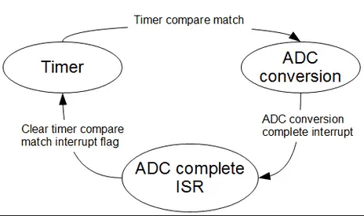

# Lab 4: Analog to Digital Converter (ADC)

This lab aims to familiarize you with the analog-to-digital converter integrated in the ATmega324P microcontroller.

## 1. Measuring Analog Signals

To measure analog signals in a digital system, they must be converted into discrete numerical values. An Analog to Digital Converter (ADC) is an electronic circuit that converts an input analog voltage into a digital output value.


A key characteristic of an ADC is its **resolution**, which indicates the number of discrete output values it can produce across the measurement range. Since the conversion results are stored in binary form, ADC resolution is typically expressed in bits.  
The **measurement quantum**—the smallest change distinguishable by the ADC—is calculated as the input voltage range divided by the number of possible output values (2^N).


For example, a 10-bit ADC provides 2^10 = 1024 different output values. For a measurement range from 0V to 5V, the quantum would be (5V - 0V)/1024 ≈ 4.8 mV.

Another important characteristic is the **sampling rate**, which determines how frequently values are converted and affects how accurately the original waveform can be reconstructed after digital processing. Below is a visual representation of how a signal reconstructed through a DAC may differ from the original depending on sampling rate.


### Nyquist Theorem

To reproduce a signal without loss, the sampling rate must be **at least twice** the highest frequency present in the signal. This applies to simple sine waves as well as complex signals like voice or music.

- Human hearing ranges from 20Hz to 20kHz, but voice transmission typically falls between 20–4000Hz.
- Telephone systems often sample at 8000Hz to ensure intelligible voice reproduction.
- CDs use 44100Hz to cover the full range of audible frequencies with high fidelity.

### ADC Types

Depending on their internal operation, ADCs can be categorized as:

- Flash ADC (Direct Conversion)
- Successive Approximation ADC
- Integrating ADC (single-slope, dual-slope)
- Sigma-Delta ADC (1-bit or oversampling types)

---

<details>
<summary>Click to expand more details</summary>

### Resolution

Resolution defines the number of discrete values an ADC can output. For example:
- 8-bit resolution = 256 levels (values 0–255)
- For a 0–5V range and 8-bit resolution: each level = 5V / 256 ≈ 0.0195V

### Sampling Rate

The sampling rate is the frequency at which the analog signal is sampled:
- Must be ≥ 2× input signal frequency (Nyquist frequency)
- Undersampling causes **aliasing**, misinterpreting high frequencies as lower ones


### ADC Architectures

#### Flash ADC

- Fastest type, uses a bank of comparators operating in parallel
- Converts almost instantaneously but requires lots of hardware


#### Successive Approximation ADC (SAR)

- Uses binary search to converge on input voltage
- More compact and cheaper than Flash, but slower


#### Sigma-Delta ADC

- Offers high resolution and low noise
- Suitable for applications where speed is less important
- Uses sample-and-hold circuit to store analog input during conversion


</details>


## 2. The ADC Converter of the ATmega324P

The analog-to-digital converter included in the ATmega324P microcontroller is a **successive approximation ADC**. It has up to **10-bit resolution** and can measure any voltage between 0–5V from eight multiplexed analog inputs (pins on port A). Additionally, it can amplify low amplitude signals with selectable gain levels of 0 dB (1x), 20 dB (10x), or 46 dB (200x).

This converter is controlled using two status and control registers (`ADCSRA` and `ADCSRB`) and a multiplexer selection register (`ADMUX`). The first two control when a conversion is triggered, whether an interrupt should be generated at the end, etc. The multiplexer register selects the input channel and the reference voltage source. Since the processor's registers are 8-bit and the ADC outputs up to 10 bits, the ADC result is split into a **low** and **high** byte.

> **Formula for conversion:**
>
> `ADC = V_in * 1024 / V_ref`  
> `V_in = ADC * V_ref / 1024`

Where `V_in` is the measured voltage and `V_ref` is the selected reference voltage.

---

### Reference Voltage

Depending on the signal range, you can select a different **reference voltage** to increase reading precision. ATmega324P allows using:
- AVCC (supply voltage)
- Internal 1.1V or 2.56V references
- External reference via the AREF pin

---

### Prescaler

The ADC requires a clock signal to determine how long a conversion lasts. Since the MCU clock is too fast, a **prescaler** is needed to divide it.

> **F_ADC = F_CPU / PRESCALER**

Prescaler values range from 2 to 128. A higher prescaler means a slower ADC clock and more accurate results. More details are in Section 25.4 of the [ATmega324P Datasheet](https://ww1.microchip.com/downloads/en/DeviceDoc/Atmel-42743-ATmega324P_Datasheet.pdf).

---

### Modes of Operation

- **Single Conversion Mode**: Performs one conversion. Start by setting `ADSC = 1`. It resets automatically after completion.
- **Free Running Mode**: Starts new conversions continuously. `ADSC` remains 1, and results are constantly updated.
- **External Interrupt Trigger**: Starts a conversion on a rising edge of a pin.
- **Analog Comparator Mode**: Compares two analog signals. (Not used in this lab.)
- **Timer Mode**: Uses timer events (e.g., overflow or compare match) to trigger conversions.



---

### Registers

#### `ADMUX` – ADC Multiplexer Selection Register


- **Bits 7:6 – REFS1:0** → Reference voltage selection  
  
- **Bit 5 – ADLAR** → Left/right result alignment
- **Bits 4:0 – MUX4:0** → Analog input channel  
  

---

#### `ADCSRA` – ADC Control and Status Register A


- **Bit 7 – ADEN**: Enable ADC  
- **Bit 6 – ADSC**: Start conversion  
- **Bit 5 – ADATE**: Enable auto trigger  
- **Bit 4 – ADIF**: Conversion complete flag  
- **Bit 3 – ADIE**: Enable ADC interrupt  
- **Bits 2:0 – ADPS2:0**: Set prescaler  
  

---

#### `ADCSRB` – ADC Control and Status Register B


- **Bits 2:0 – ADTS2:0**: Auto trigger source  
  

---

### Example

**Initialization to read from pin PA1 (ADC1):**
```c
ADMUX = 0;
// Select ADC1
ADMUX |= (1 << MUX0);
// Use AVCC as reference voltage
ADMUX |= (1 << REFS0);

ADCSRA = 0;
// Set prescaler to 128
ADCSRA |= (7 << ADPS0);
// Enable ADC
ADCSRA |= (1 << ADEN);
```

**Read conversion result:**
```c
// Start conversion
ADCSRA |= (1 << ADSC);
// Wait for conversion to complete
while (ADCSRA & (1 << ADSC));

uint16_t result = ADC; // Combined 10-bit result
```

## 4. Exercises

The objective of these exercises is to use the **analog-to-digital converter (ADC)** integrated into the ATmega324P microcontroller to perform various readings (multiplexed buttons via voltage dividers, temperature sensor).

Download the code skeleton: 

---

### **Task 0**

Complete the provided code skeleton (`adc.c`) by implementing a function similar to `analogRead(uint8_t pin)`. This function should:

- Perform a **single conversion** on the specified analog pin.
- **Block** execution until the result is available.
- Return the **converted digital value**.

---

### **Task 1**

Using the `analogRead()` function, read values from the **temperature sensor** connected to pin **PA0**. 

- Touch the sensor (carefully) with your finger and observe how the readings change.
- Optional: print the value via serial output.

---

### **Task 2**

Buttons 1–6 are **multiplexed** on a single analog pin **PA5**, using **voltage dividers**. Refer to the hardware schematic for a visual explanation.

Steps:
1. Determine the **analog value ranges** returned when each button is pressed.
2. Define appropriate threshold values using `#define` macros.
3. Implement logic such that:
   - **BTN2** → turn on **Red LED**
   - **BTN3** → turn on **Green LED**
   - **BTN5** → turn on **Blue LED**

---

### **Task 3**

Configure the ADC to **automatically** start conversions on the **temperature sensor (PA0)** **every 1 second**, using **Timer1**.

Hints:
- Timer1 is already configured to trigger interrupts every second.
- Check the datasheet for:
  - **ADATE (Auto Trigger Enable)**
  - **ADTS (Auto Trigger Source)** fields in `ADCSRA` and `ADCSRB`
- Optionally, instead of using auto-triggering, you can **manually call** `analogRead()` from the Timer1 interrupt handler.

---

## 5. Useful Links

- 📘 [ATmega324P Datasheet](https://ww1.microchip.com/downloads/en/DeviceDoc/Atmel-42743-ATmega324P_Datasheet.pdf)
- 🔧 [PM-Board Hardware Docs](https://github.com/dantudose/PM-Board)
- 🔲 [Multiplexed Buttons on One Pin](https://www.instructables.com/Accessing-5-buttons-through-1-Arduino-pin-Revisi)
