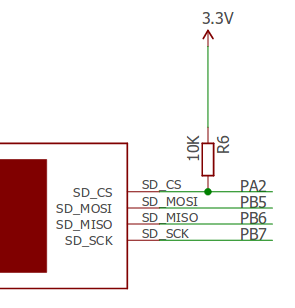

# Lab 5: SPI (Serial Peripheral Interface)

## 1. Introduction

In this lab, we’ll explore the SPI communication protocol, widely used in embedded systems for data exchange between two or more devices. The final objective will be to build an audio player on the lab board that reads *.wav* files from an SD card and plays them using the onboard speaker.

---

## 2. SPI Protocol (Serial Peripheral Interface)

SPI is a synchronous communication standard developed by Motorola. It operates in full-duplex mode (data transfer happens simultaneously in both directions).

Communication is based on a **Master-Slave** architecture (one Master device and one or more Slaves). The **Master** always initiates communication.

SPI is also known as a *four-wire* protocol due to its use of four separate lines:

- **MOSI** — Master Out Slave In (data from **Master** to **Slave**)
- **MISO** — Master In Slave Out (data from **Slave** to **Master**)
- **SCLK** — Serial Clock (clock signal generated by the **Master**)
- **CS / SS** — Chip Select / Slave Select (used by the **Master** to select the **Slave**; active LOW)


---

### 2.1 Connecting Multiple Slaves

Multiple **Slave** devices can be connected to a single **Master**. The *MOSI*, *MISO*, and *SCLK* lines are shared, while each **Slave** has a separate *CS / SS* line.

When the **Master** wants to communicate with a particular **Slave**, it sets the corresponding *CS / SS* line to **LOW** (active). All other *SS* lines remain **HIGH**, and those **Slaves** ignore communication.


---

## 3. Data Transmission in SPI

To begin communication:
1. The **Master** sets the clock frequency (must not exceed the **Slave**'s max supported rate).
2. It selects the **Slave** by setting its *CS / SS* line LOW.

During each SPI clock cycle (full-duplex):
- The **Master** sends a bit via *MOSI*, and the **Slave** reads it.
- The **Slave** simultaneously sends a bit via *MISO*, which the **Master** reads.

This is usually done through circularly connected **shift registers** in both **Master** and **Slave**.


Typically:
- The most significant bit (MSB) is sent first.
- After one word is transmitted, both devices will have exchanged the entire contents of their shift registers.

Once data transmission is complete:
- The **Master** stops the clock signal (*SCLK*).
- It deactivates the **Slave** by setting the associated *CS / SS* line to **HIGH**.


**Note**: All unselected **Slaves** ignore clock and *MOSI* lines and don’t drive the *MISO* line.
Only one **Slave** can be selected at a time by the **Master**.


## 4. SPI on ATMega324

The ATMega324 microcontroller provides users with an SPI interface that can operate in both **Master** and **Slave** modes.

As usual, configuring and using this interface involves working with control, status, and data registers.

The full description of the SPI-related registers can be found in the [ATmega324P Datasheet](https://ww1.microchip.com/downloads/en/DeviceDoc/Atmel-42743-ATmega324P_Datasheet.pdf), Chapter: **SPI – Serial Peripheral Interface** (starting on page 214).

Below is a brief overview of the most important SPI registers and fields:

---

### SPI Control Register (SPCR)

| Bit   | Name   | Description |
|-------|--------|-------------|
| 6     | **SPE**   | SPI Enable — Set to 1 to enable the SPI interface |
| 5     | **DORD**  | Data Order — 1: LSB transmitted first, 0: MSB first |
| 4     | **MSTR**  | Master/Slave Select — 1: Master mode, 0: Slave mode |
| 3-0   | **CPOL, CPHA, SPR1, SPR0** | Clock polarity, phase, and frequency selection |


---

### SPI Status Register (SPSR)

| Bit   | Name   | Description |
|-------|--------|-------------|
| 7     | **SPIF**  | SPI Interrupt Flag — Set to 1 when a transfer is complete |


---

### SPI Data Register (SPDR)

The **SPDR** register is used to both transmit and receive data:
- Writing to this register **starts a new transmission** (in **Master** mode).
- Reading from it gives you the data received via SPI.


---

## 5. FAT SD Card

The lab board includes an SD card reader that communicates with the ATMega324 microcontroller via the SPI protocol — which is the main use case for today’s lab.

The diagram below shows how the SD card reader is connected to the microcontroller. Notice that some of the pins we've already used in past labs are reused here for SPI signals.



---

### SD Card Format: FAT32

The SD cards we'll be working with are formatted using the **FAT32** file system. To simplify file operations, we’ll use the **Petit FAT Filesystem** library — chosen for its small footprint (2–4 KB) and minimal RAM usage (just 46 bytes plus stack).

---

### Petit FAT Filesystem API

Here are the main functions provided by the library:

```c
FRESULT pf_mount (FATFS*);                   // Mount or unmount a volume
FRESULT pf_open (const char*);               // Open a file
FRESULT pf_read (void*, WORD, WORD*);        // Read data from a file
FRESULT pf_write (const void*, WORD, WORD*); // Write data to a file
FRESULT pf_lseek (DWORD);                    // Move file pointer
FRESULT pf_opendir (DIR*, const char*);      // Open a directory
FRESULT pf_readdir (DIR*, FILINFO*);         // Read from a directory
```

These functions allow low-level file access from an embedded system — exactly what we need to implement a basic audio player on our microcontroller board.

## 6. Exercises

📥 **Download the starter code archive:**  
[lab5_skel.zip](https://ocw.cs.pub.ro/courses/_media/pm/lab/lab5_skel.zip)

In this lab, you won’t be writing a lot of code, but it’s important to understand how your code interacts with the skeleton and the behavior of the library functions you’ll use.

---

###  Task 1: SPI Control

Implement the basic SPI communication functions in `spi.c`:
- `SPI_init()`
- `SPI_exchange()`

:::tip

- Configure **PB4 (SS)** as output and set it to **HIGH** to disable SPI interrupt triggering via slave select.
- Follow examples from **page 217** of the datasheet.
- Refer to section 5's wiring diagram to identify **MOSI** and **SCLK** pins.
- Set SPI to **Master** mode with **SCLK = fosc/16** (slower frequency for SD card compatibility).
- Remember to use register names with a `0` suffix: `SPCR0`, `SPDR0`, etc.
- Use `SPDR0` to send data and receive the response in one function (full-duplex), replacing the need for `SPI_read()` and `SPI_write()`.

:::
---

###  Task 2: SD Card Control

In `sd.c`, implement:
- `SD_init()`
- `SD_receive()`
- `SD_transmit()`

:::tip
- **PA2** (SS for SD card) must be set as output. Leave the HIGH/LOW handling to the skeleton code.
- Use `SPI_exchange()` for both transmitting and receiving.
- In `SD_receive()`, send **0xFF** as a dummy byte to initiate a read (Master must always initiate).
- ✅ **Checkpoint:** After flashing your code, the LCD should change from `Mounting...` to `Mounted!`. If not, hit the **RESET** button and debug if needed.
:::

---

### Task 3: First File Display

Implement `init_directory()` in `lab5.c` to show the first `.wav` file from the `/music` directory:
- Use `pf_opendir()` to open the directory.
- Use `pf_readdir()` to iterate through entries.
- Skip files starting with an underscore `_`.
- Use `LCD_clear_top_line()` and `LCD_printAt()` to display the file name.

---

### Task 4: File Cycling

In `lab5.c`, handle button **PB2**:
- On press, show the **next valid file** from `/music` (skip names starting with `_`).
- If at the last file, wrap around to the **first** file.
- `pf_readdir()` returns a file with name `""` (empty string) at the end of the directory.
- Add a **delay (200–300ms)** to avoid multiple file changes on a single button press.

---

### Task 5: Play Music 🎵

When **PD6** is pressed, call `play()` to play the currently displayed file:
- Implement the behavior in the `TODO5` section of `lab5.c`.
- Playback can be **interrupted** by pressing **PD6 + PB2** together — this is already handled in the skeleton.

---

## 🔗 Useful Links

- 📘 [ATmega324P Datasheet](https://ww1.microchip.com/downloads/en/DeviceDoc/Atmel-42743-ATmega324P_Datasheet.pdf)
- 💾 [FAT SD Card Tutorial](https://codeandlife.com/2012/04/25/simple-fat-and-sd-tutorial-part-3/)
- 🔄 [SPI Protocol Guide](https://learn.sparkfun.com/tutorials/serial-peripheral-interface-spi/all)
