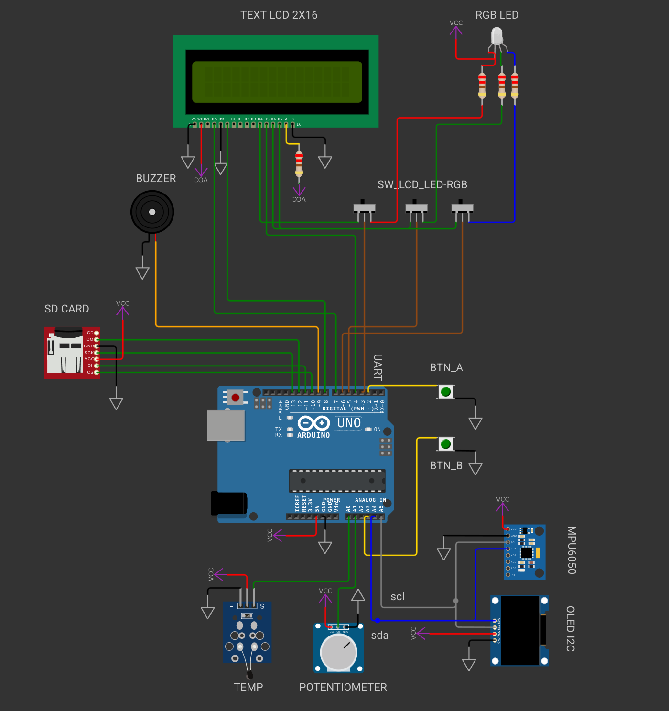

import TwoColumn from '@site/src/components/TwoColumn';
import CodeSnippet from '@site/src/components/CodeSnippet.tsx';
import * as snippets from '@site/snippets/code-snippets01.mdx';
import Tabs from '@theme/Tabs';
import TabItem from '@theme/TabItem';

# Lab 6: I2C (Inter-Integrated Circuit)

This lab focuses on understanding and using the I2C protocol on the ATmega324P microcontroller. For further reading, refer to the [ATmega324P Datasheet](https://ww1.microchip.com/downloads/en/DeviceDoc/Atmel-42743-ATmega324P_Datasheet.pdf) and [Wikipedia: I2C](https://en.wikipedia.org/wiki/I%C2%B2C).

---

## 1. What is I2C?

I2C (also known as IIC or TWI - Two-Wire Interface) is a synchronous, serial, half-duplex communication protocol developed by Philips in 1982. It is commonly used for communication between microcontrollers and sensors or memory devices.

An I2C bus uses two signals:
- **SDA** – Serial Data Line
- **SCL** – Serial Clock Line

The clock is always generated by the master. Only one device at a time can transmit on the SDA line, making I2C half-duplex.


---

## 2. How I2C Works

Unlike SPI, I2C does not need a separate *Slave Select* line. Instead, each slave has a unique **address** (usually 7-bit), and communication is always initiated by the **Master**.

Communication is divided into:
- One **Address Frame**
- One or more **Data Frames**

Messages are surrounded by special signals:
- **Start Condition**
- **Stop Condition**


---

### 2.1 Start Condition

Before sending the slave's address, the **Master** must generate a **Start Condition**:
- While SCL is HIGH, SDA transitions from HIGH to LOW.

This signals all slaves to listen for an address.

---

### 2.2 Address Frame

After the start condition, the master sends:
- 7 bits: Slave Address (A6–A0)
- 1 bit: R/W (0 = Write, 1 = Read)

The slave that recognizes its address sends an **ACK** by pulling SDA LOW during the 9th clock cycle.

If SDA remains HIGH during this 9th clock, it's a **NACK**.

---

### 2.3 Data Frames

If ACK was received, the master proceeds with:
- **Writing**: Master sends bytes, slave ACKs each.
- **Reading**: Slave sends bytes, master ACKs each.

To end a read, the **Master sends a NACK** instead of ACK on the last byte.

Each byte is followed by an ACK/NACK depending on direction.

---

### 2.4 Stop Condition

To end communication, the master issues a **Stop Condition**:
- SDA transitions from LOW to HIGH **after** SCL is HIGH.


---
:::info

 Multiple slaves can share the same bus, but are addressed individually using their unique addresses (typically 7-bit). The LSB of the address frame indicates read (1) or write (0). Once the slave is selected, data transmission begins.

 :::

## 3. I2C Configuration Registers

The ATmega324P microcontroller supports both I2C Master and Slave operation modes.

---

### TWI Bit Rate Register (`TWBR`)


- This register sets the frequency divider that determines the SCL clock speed when in **Master mode**.

---

### TWI Control Register (`TWCR`)


- The control register is used to enable I2C communication, initiate start/stop conditions, acknowledge received data, and check for collisions.
  
| Bit | Name  | Description |
|-----|-------|-------------|
| 7   | TWINT | TWI Interrupt Flag (set by HW, cleared by writing 1 in SW) |
| 6   | TWEA  | Enable Acknowledge: 1 = send ACK, 0 = NACK (disconnect) |
| 2   | TWEN  | Enable TWI module: 1 = enable, 0 = disable |

---

### TWI Status Register (`TWSR`)


- Indicates current TWI status (start sent, address acknowledged, etc.) and prescaler settings.

---

### TWI Data Register (`TWDR`)


- Contains the next byte to transmit (TX) or the last byte received (RX), depending on context.

---

## 4. Using the I2C Module on AVR

Setting up the I2C module is straightforward — you mainly need to set the clock frequency.

### Example: Initialize I2C at 100kHz

```c
void twi_init(void)
{
  // Set prescaler to 1 (TWPS = 00)
  TWSR = (0 << TWPS0);

  // Set bitrate register
  // Formula: TWBR = (F_CPU / SCL_freq - 16) / (2 * prescaler)
  TWBR = 52; // For 12MHz CPU clock and 100kHz SCL
}
```

However, performing a full I2C transaction is more complex and involves the following steps:

1. Set `TWCR` to issue a **START condition**.
2. Wait for completion (poll `TWCR.TWINT`).
3. Load the **slave address** into `TWDR` and start transmission.
4. Wait and check for **ACK** using `TWSR`.
5. Transmit or receive data bytes via `TWDR`, with appropriate waiting after each.
6. Issue a **STOP condition** using another flag in `TWCR`.

---

## 5. Pressure Sensor – MPL3115A2

The lab board includes an **MPL3115A2** pressure and temperature sensor that communicates via I2C.

### I2C Pins for the Sensor:

| I2C Signal | GPIO Pin |
|------------|-----------|
| Enable     | PA6       |
| SCL        | PC0       |
| SDA        | PC1       |

Communication with the sensor requires **read/write access to its internal registers** via I2C. Before either operation, the **register address must be sent**.

Register map and their respective addresses can be found in the [MPL3115A2 Datasheet](https://www.nxp.com/docs/en/data-sheet/MPL3115A2.pdf), section 14.


## 6. Exercises

<Tabs>
  <TabItem value="lab_work" label="Lab Work">

Download the [code skeleton archive](https://ocw.cs.pub.ro/courses/_media/pm/lab/lab6/lab6-skel-2023-2024.zip) and follow the instructions marked with `TODO`.

---

### **Task 0** – Basic I2C Initialization

Complete the bodies of the functions `twi_init`, `twi_start`, and `twi_stop` in the `twi.c` file.

> 💡 Constant definitions can be found in [avr-libc util/twi.h](https://www.nongnu.org/avr-libc/user-manual/group__util__twi.html)

---

### **Task 1** – Reading and Writing

Implement the functions `twi_read_ack`, `twi_read_nack`, and `twi_write` in `twi.c`.

> 💡 Tip: See Table `23-2`, page 268 of the [ATmega324P Datasheet](https://ww1.microchip.com/downloads/en/DeviceDoc/Atmel-42743-ATmega324P_Datasheet.pdf) for a full example.

---

### **Task 2** – Discover Devices on I2C Bus

Implement `twi_discover` in `twi.c`. This function should send a read address (SLA_R) to all possible I2C addresses (0–127) and detect which devices respond with ACK.

- Display connected device addresses via serial.
- Make sure to call this function in `main()`.

> 💡 Tip: Use the `TWSR` register to check if the slave acknowledged (ACK). See Table `23-4`, page 275 in the datasheet for status codes.

**To send a read or write address:**

```c
// Read address
(DEVICE_ADDRESS << 1) | 1

// Write address
DEVICE_ADDRESS << 1
```

📌 The sensor address is `0x60` → read = `0xC1`, write = `0xC0`.

---

### **Task 3** – MPL3115A2 Pressure Sensor

We will now configure and read from the **MPL3115A2** I2C sensor.

#### Task 3.1 – Initialize Sensor

Complete `mpl3115a2_init` in `mpl3115a2.c`. This should be called once in `main()` before entering the loop.

📌 Set `CTRL_REG1` accordingly to operate in **pressure mode** (make sure the `ALT` bit is 0).

---

#### Task 3.2 – Read Pressure and Temperature

Complete `mpl3115a2_read_pressure` and `mpl3115a2_read_temperature` in `mpl3115a2.c`. Call these in the main loop and print the values over serial.

:::tip Hint 1
 Section `14` of the [MPL3115A2 Datasheet](https://www.nxp.com/docs/en/data-sheet/MPL3115A2.pdf) contains register descriptions.
:::

:::tip Hint 2
Pressure formula (Q18.2 format):

```c
PRESSURE = (OUT_P_MSB << 12) | (OUT_P_CSB << 4) | (OUT_P_LSB >> 4);
```
:::
---

### Read Register Sequence

Use the following sequence when reading from a register:

```c
twi_start();
twi_write(DEVICE_ADDRESS << 1);        // SLA + W
twi_write(REGISTER_ADDRESS);           // register to read
twi_start();                           // repeated START
twi_write((DEVICE_ADDRESS << 1) | 1);  // SLA + R

uint8_t data = 0;
twi_read_nack(&data);
twi_stop();
```

---

✅ After completing the tasks, you should be able to communicate with the MPL3115A2, detect its address, configure it, and read valid pressure and temperature values.

---

</TabItem>
<TabItem value="hw" label="Homework">

:::note 
From now on you will be working with [Wokwi](https://docs.wokwi.com/?utm_source=wokwi) because its easier to import libraries. 
The **📥[homework skeleton](https://github.com/UPB-FILS-AM-FR/Homework_template_2025)** will be the same for all the labs.
You don't need to modify the circuit for the homework. You will only change the .c and .h files. The connections to the peripherals wil be different from the ones in the lab development board. For the homework you will work with Arduino Uno (ATmega328P).



Make sure to read the [`README.md`](https://github.com/UPB-FILS-AM-FR/Homework_template_2025/blob/main/README.md) before solving the exercises.
:::

### **Task 0** – Basic I2C Initialization

Complete the bodies of the functions `twi_init`, `twi_start`, and `twi_stop` in the `twi.c` file.

> 💡 Constant definitions can be found in [avr-libc util/twi.h](https://www.nongnu.org/avr-libc/user-manual/group__util__twi.html)

---

### **Task 1** – Reading and Writing

Implement the functions `twi_read_ack`, `twi_read_nack`, and `twi_write` in `twi.c`.

> 💡 Tip: See Table `23-2`, page 268 of the [ATmega324P Datasheet](https://ww1.microchip.com/downloads/en/DeviceDoc/Atmel-42743-ATmega324P_Datasheet.pdf) for a full example.

---

### **Task 2** – Discover Devices on I2C Bus

Implement `twi_discover` in `twi.c`. This function should send a read address (SLA_R) to all possible I2C addresses (0–127) and detect which devices respond with ACK.

- Display connected device addresses via serial.
- Make sure to call this function in `main()`.

> 💡 Tip: Use the `TWSR` register to check if the slave acknowledged (ACK). See Table `23-4`, page 275 in the datasheet for status codes.

**To send a read or write address:**

```c
// Read address
(DEVICE_ADDRESS << 1) | 1

// Write address
DEVICE_ADDRESS << 1
```

📌 The sensor address is `0x60` → read = `0xC1`, write = `0xC0`.

---

### **Task 3** – MPU6050 accelerometer


To get the data we want from the digital sensor, we need to access its internal registers. 
The MPU-6500 has some rules when it comes to reading and writing to these registers, that must be extracted from the datasheets. 
Every sensor has different registers, and different ways of interfacing them, so reading the [datasheet](https://invensense.tdk.com/products/motion-tracking/6-axis/mpu-6500/#documentation) is usually required, 
especially when we don't have the leverage of using already existing libraries for these sensors.

Get the acceleration and angular velocity readings from the sensor.
- Configure the full scale as ±2g for the acceleration and ±1000°/s for the angular velocity 
- Read the raw values for the X axis of the accelerometer and print them in a loop. 


### Read Register Sequence

Use the following sequence when reading from a register:

```c
twi_start();
twi_write(DEVICE_ADDRESS << 1);        // SLA + W
twi_write(REGISTER_ADDRESS);           // register to read
twi_start();                           // repeated START
twi_write((DEVICE_ADDRESS << 1) | 1);  // SLA + R

uint8_t data = 0;
twi_read_nack(&data);
twi_stop();
```

---

✅ After completing the tasks, you should be able to communicate with the MPL3115A2, detect its address, configure it, and read valid pressure and temperature values.

---


</TabItem>
</Tabs>

### 🔗 Useful Links

- [ATmega324P Datasheet](https://ww1.microchip.com/downloads/en/DeviceDoc/Atmel-42743-ATmega324P_Datasheet.pdf)
- [MPL3115A2 Datasheet](https://www.nxp.com/docs/en/data-sheet/MPL3115A2.pdf)
- [I2C Tutorial by SparkFun](https://learn.sparkfun.com/tutorials/i2c/all)
