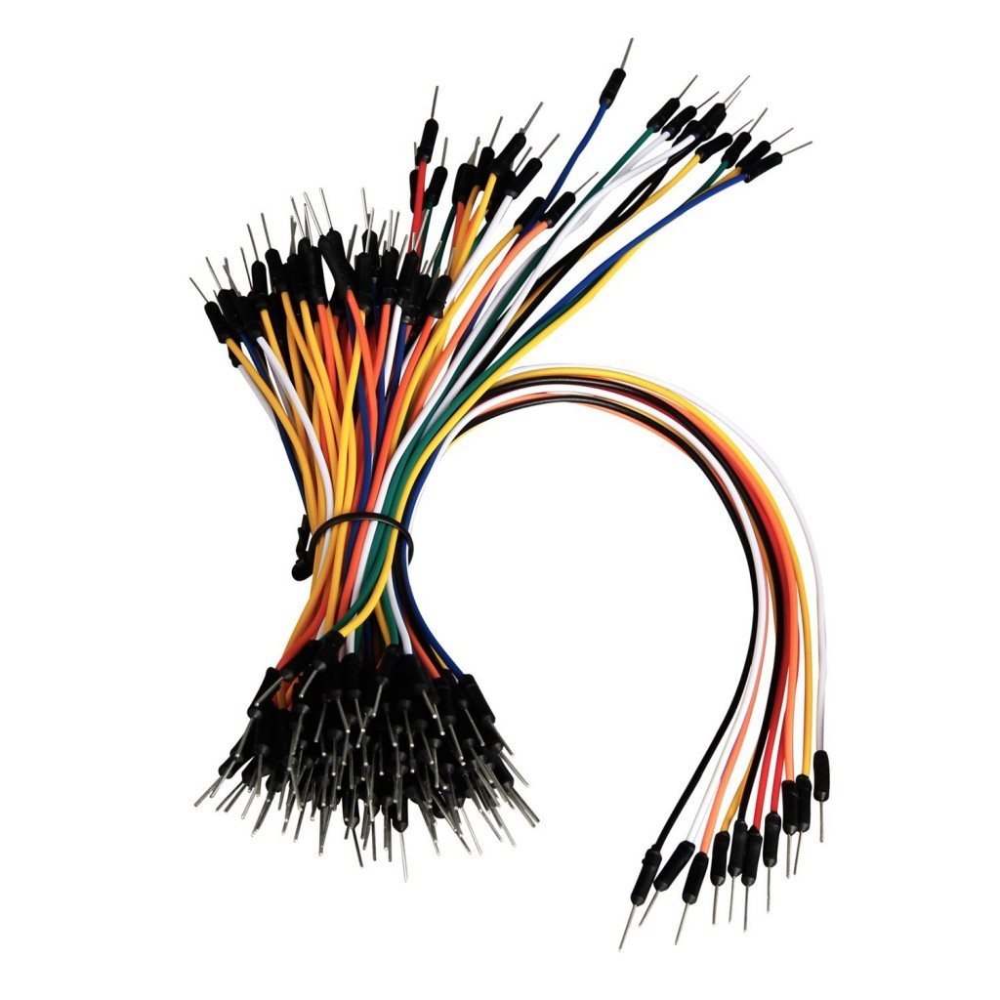
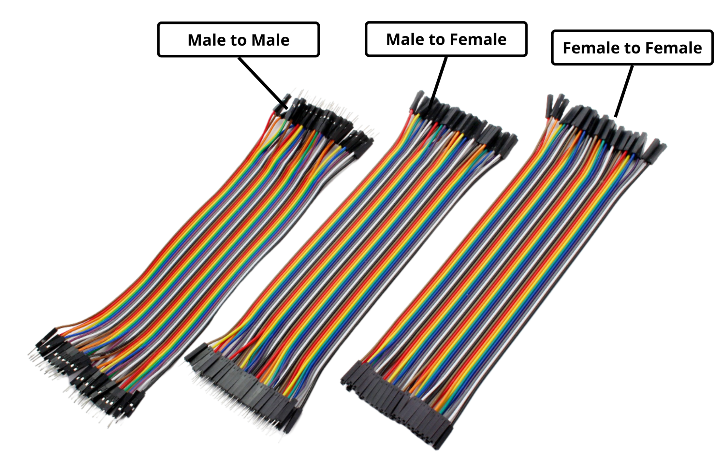
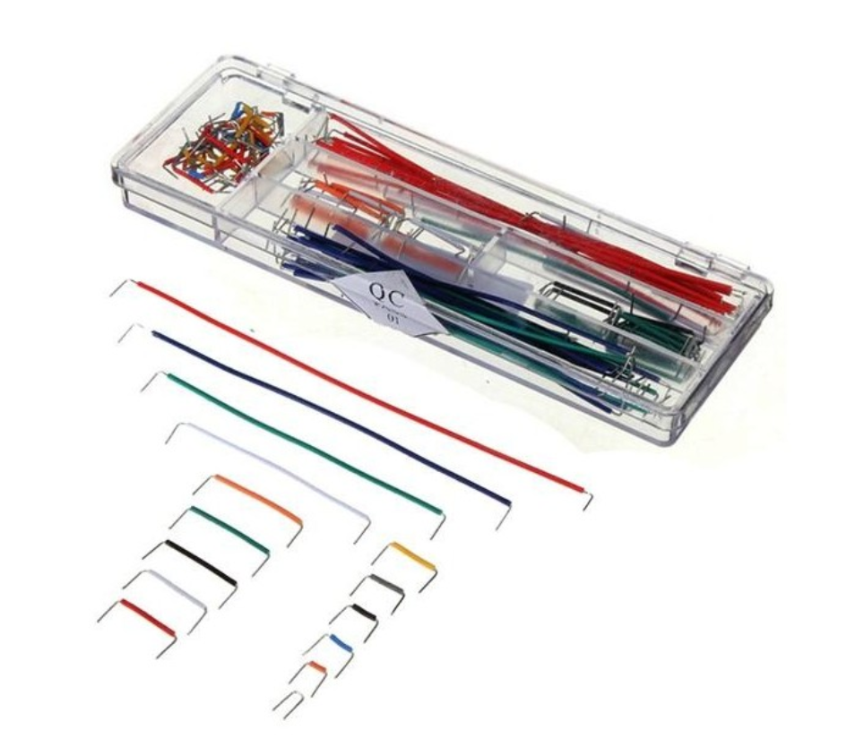
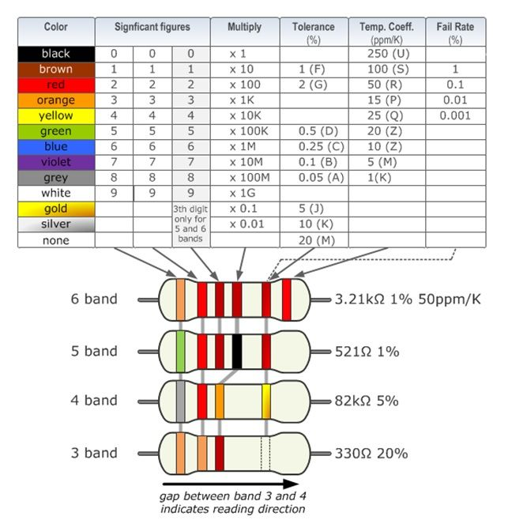
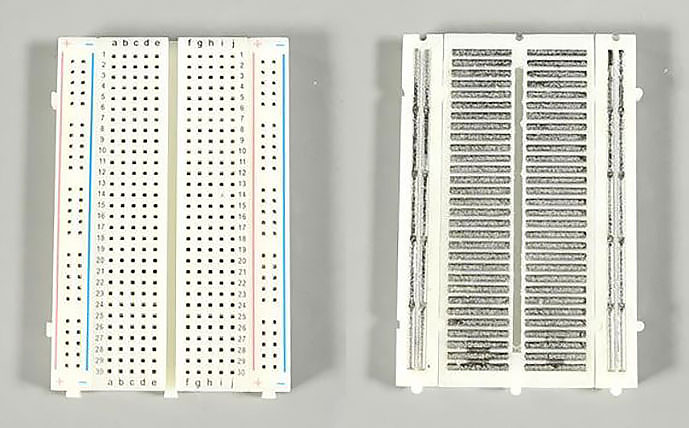
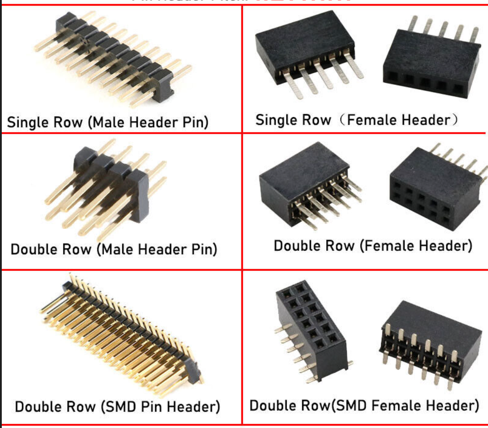
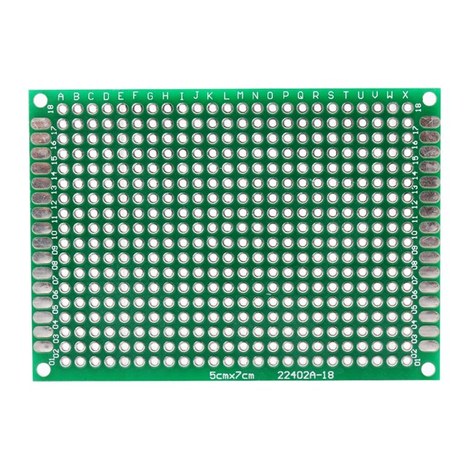

# Project Resources

What is on this page:

1. [List of Microcontrollers that you can use](#microcontrollers-that-you-can-use)
2. [Useful Universal parts](#must-haves)
3. [Where to Buy Components](#where-to-buy)
4. [Tools for Designing your Circuit](#designing-your-circuit)

## Microcontrollers that you can use

- Arduino nano
- Arduino uno
- Other Arduino boards are also ok
- Raspberry Pi Pico

If you need Wi-Fi :
- Raspberry Pi Pico W
- Raspberry Pi Pico 2W
- Arduino Nano RP2040 Connect
- ESP32-DevKit
- nRF52 DK

:::note 
This is not a complete list. Ask the lab assistant or teacher if you want to use another board.
:::

:::danger warning
You **cannot** use boards that support fully fledge operating systems like Raspberry Pi 1,2,3,4,5.

You **cannot** use python or other scripting/block languages. The idea is to implement the protocols yourself with what you have learned at the lab. 

If you plan on using boards with modern microcontrollers ARM or RISCV you can use more complex frameworks.
:::

## Must haves

**Apart from** the **microcontroller** and the **peripherals** needed for your project, you will also need:

### (Jumper) Wires
There are multiple types of wires. (You don't need to get all these types)
They don't have very specific names :). 

| | | |
|-|-|-|
| 1. **Simple flexible jumper wires** - cheapest and most common, easier reach for pins &emsp;&emsp;&emsp;&emsp;&emsp;&emsp;&emsp;&emsp;&emsp;&emsp;&emsp; |  2. **Flexible jumper wires band** - great for when you need to connect multiple consecutive pins &emsp;&emsp;&emsp;&emsp;&emsp;&emsp;&emsp;&emsp;&emsp;&emsp;&emsp;&emsp;&emsp;&emsp; | 3. **Solid/Rigid wires** (usually come in a box and cheaper than solid core wire spool) - great for Breadboards and prototyping PCBs, cleaner looking setup compared to flexible jumper wires |
|  |  |  |

### Resistors
Resistors are almost always needed in a project. Wether you want to connect and LED, a photoresistor, a potentiometer or even a simple button you will need to use resistors.
Resistors are used to reduce current, lower voltage, and control signal levels. Basic applications: "pull up resistors", "pull down resistors" or "voltage dividers".

Simple through-hole resistors are color coded so you can determine what is their resistance.

### Breadboards
Breadboards are great for prototyping. They do not require to solder components and wires. If you're unfamiliar with how breadboards work, check out this [link](https://www.build-electronic-circuits.com/breadboard/).

### Header Pins
If you buy a microcontrollers like "arduino nano" or "raspberry pi pico" and so on, they usually do not have the header pins already soldered, so you need to buy them separately.
You can always snap header pin bars in multiple pieces to get the amount that you need for your peripheral/MCU.

:::warning
Make sure you buy the appropriate size for your peripheral. If you are unsure you can always ask the lab assistant.
:::

### PCB for prototyping (Universal prototype board)
If you want your project to look neat, you might want to use one of these instead of Breadboards.
Breadboards are great for when you don't want to solder the components yet, however they can be a bit flimsy when it comes to the wiring and not very compact.

## What you will probably need, but don't have to buy

- For your project you will need to **solder** some of your components. We have soldering irons in the lab (ED218), you will learn how to solder in the project hours. (If you need additional hours for soldering just ask the lab assistant)
- **Multimeter** - its good to have at home for debugging the circuit, but you don't need to buy one, we have at the lab a few. ( We also have **oscilloscopes**, although it's less probable that you will need one for your project).
- You might want to **3D print** a nice case or some specific mechanical component for your project. If so, just ask the lab assistant for help. They can either 3D print the object if its small enough or guide you to chose a 3D printing shop.
- If you cannot afford to buy the components, we can **lend you some kits**. Just note that we don't have kits for everyone.

## Where to buy

In general, I would choose local shops to avoid shipping costs. 
A good idea would be to buy an electronics kit for multiple people to use. A good kit should contain at least some wires, resistors, leds, transistors, capacitors (different types).
Most kits probably also have some motors + drivers and a few common chips (one of each / kit so not enough to share).

:::info 
This is not a full list of shops, nor do i expect you to buy from these places. You can always chose whatever shop you like.
:::

- https://www.optimusdigital.ro/en/ - near UPB, you can pick up the components yourself 
- https://cleste.ro/
- https://sigmanortec.ro/
- https://ardushop.ro/ro/

And many more [electronics shops on Str. "Maica Domunului"](https://www.google.com/search?q=magazine+electronice+maica+domnului+bucuresti&sca_esv=326bfc1759a095a4&udm=1&sa=X&sqi=2&ved=2ahUKEwiSmtavrq2MAxUJQlUIHaCbL6AQjGp6BAgbEAE&biw=1920&bih=961&dpr=2)

----
If you cannot find what you need locally you can also look on :
- https://ro.mouser.com/
- https://www.tme.eu/ro/

I don't recommend shops like Digikey or Vector etc. because they usually don't handle all duties/taxes for you. 

**Rule of thumb** : if you cannot find what you need in Romania, search shops from EU.

:::note
Please don't buy already made project kits like : cars, line followers etc, unless you add other significant/important functionalities to the project.
:::

## Designing your circuit

- [Kicad](https://www.kicad.org/) - Open Source Electronics Design Automation Suite

- [TinkerCad](https://www.kicad.org/)

## Other Useful links

    - [Kicad Tutorials](https://www.youtube.com/playlist?list=PLZNH6jlLeFXsg9ohRMbJ0qqSfUrRyAn7b)

    - [Electronic components 101](https://components101.com/)

    - [Octopart - Search engine for electronic components](https://octopart.com/)

    - [Identifying Iransistors](https://www.elprocus.com/easy-pin-identification/#:~:text=In%20NPN%20type%2C%20the%20pin,to%20the%20Tab%20is%20Collector.&text=To%20identify%20a%20Field%20Effect,in%20the%20anti%2Dclockwise%20direction.)

